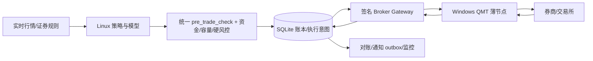

# 自动交易与券商接入就绪度审查报告

审查日期：2026-10-02（Asia/Shanghai）
审查对象：`C:\storage\stock-analysis`，当前分支 `main`，HEAD `42f396e`
目标：判断项目距离“自动交易量化产品 + 券商接入”还缺什么，并与当前 GitHub 开源量化产品对照。

> 本次审查后的工作区仍有未提交改动；本文保留 `42f396e` 作为审查起点，当前增量以主路线图和本地实施计划为准。

范围说明：按 `AGENTS.md` 以主文档和有效从文档为准，审查了活动源码、测试、部署脚本和有效文档；`docs/archive/`、`cache/`、`output/` 视为历史/运行产物，不作为当前实现依据。当前环境未安装 semgrep、bandit、OSV-Scanner、Trivy 或 Gitleaks，因此安全部分采用人工关键路径审查，并以测试、配置和运行脚本作交叉验证。

## 结论

当前项目已经形成研究、候选生成、时点历史回测、JoinQuant 模拟执行、SQLite 交易账本、分层退出、对账、通知和模型旁路观察的完整骨架。它现在的准确定位是：**研究与模拟盘执行系统，距离可承受真实资金的券商执行产品还差一个完整的执行平面和一轮真实交易日验证**。

在实现 QMT/BrokerAdapter、完成账户隔离和执行故障演练前，不应开启真实买入。主文档已经把 Batch D/QMT 标为 `planned / not implemented / not deployed / not observed / not validated`；Batch A/B/C 虽然已经部署，也仍明确标为 `not observed / not validated`。这不是文档措辞问题，而是实盘系统必须遵守的证据边界。

## 证据摘要

| 项目 | 证据 | 判断 |
| --- | --- | --- |
| QMT 接入 | `docs/project_roadmap.md:58-62`、`docs/superpowers/plans/2026-07-28-broker-adapter-qmt-node.md:1-11` | `broker_contracts.py`、`broker_gateway.py`、`qmt_adapter.py`、`qmt_node.py` 等计划文件尚未落地。 |
| 多账户边界 | `docs/project_roadmap.md:66-70`；`trading_store.py:187-188,223-224` | 当前 `position_cycles`、`exit_intents` 的活动股票唯一约束没有账户作用域；JoinQuant 与 QMT 双账户不能安全并行。 |
| 运行证据 | `docs/project_roadmap.md:68-70` | 服务器部署和测试通过不能替代真实交易日观察、失败回报、部分成交、断线和重启恢复证据。 |
| 本地回归 | `.venv\Scripts\python.exe -m unittest discover -s tests -p 'test_*.py' -q` | 当前工作区 1080 项，1077 项通过、3 项因 Windows 无 Linux `bash` 明确跳过；`pip check`、全仓库编译和 `git diff --check` 通过。 |
| 依赖可复现性 | `requirements.txt`、`requirements-py310.lock` | 本地 Python 3.10 依赖已锁定并通过 `pip check`；Linux/服务器仍需独立锁定和 CI/SBOM 门禁。 |
| 网络入口 | `config.py:543-550`、`run_ubuntu.sh:450-462`、`joinquant_signal_server.py:243-250` | 面板和 JoinQuant API 默认绑定 `0.0.0.0`；API 接受 URL query token；systemd 单元未指定非 root 用户、TLS、速率限制或服务硬化。 |
| 日志增长 | `joinquant_signal_server.py:523-528`、`joinquant_health.py:236-250,367-370,439-441`、`run_ubuntu.sh:43-44,970` | 账户/API/健康 JSONL 持续追加，健康任务每轮全量读取；清理命令存在但不在定时器列表中，长期运行会形成容量和延迟风险。 |
| 本地账本 | `trading_store.py:48`；工作区 `cache/trading/trading.db` | 代码支持 schema 12，而本地运行库当前是 schema 10；必须把“代码版本—数据库迁移—备份恢复”作为发布门禁。 |

## 当前能力矩阵

| 能力 | 当前状态 | 到真实券商还缺什么 |
| --- | --- | --- |
| 策略与因子 | 已实现多路径因子、候选池、市场环境和分层退出 | 需要长期样本、容量、换手、滑点和交易成本的稳定性证据。 |
| 反前视回测 | 已有 strict 导出、PIT 数据和回测框架 | 真实完整月包、6–12 个月回测、至少 3 段 walk-forward 和保留集结果尚未形成可审计证据。 |
| 账本与风控 | schema 12、原子准入、精确数量、对账、通知 outbox 已实现 | 需要 schema 13 的节点租约、提交许可、nonce、防重放、未知提交恢复和多账户全链路。 |
| JoinQuant | 有运行身份校验、快照同步和模板版本检查 | 它是模拟执行适配器，不能替代券商适配器；新买卖语义仍缺代表性交易日观察。 |
| ML | 五头训练/治理代码存在，默认关闭 | 没有真实一年 strict 数据、活动模型、L0 交易日证据；不应成为实盘前置条件。 |
| 券商执行 | 仅有统一执行契约和设计文档 | 缺 Linux gateway、Windows QMT node、XtQuant 映射、事件回传、撤单、重连和故障模拟器。 |
| 运维安全 | 有 systemd、备份、健康报告和 kill switch | 缺 TLS/VPN/mTLS、非 root 服务、最小权限、RBAC/MFA、监控指标、值班和回滚演练。 |

## 必须补充的发现

### P0：执行平面尚未实现

现在没有可以把 `ExecutionIntent` 安全送进券商并把订单/成交事实带回账本的代码。必须按现有 Batch D 计划落地：

1. `broker_contracts.py`：统一订单、成交、账户、持仓、能力和适配器协议。
2. `broker_protocol.py`：带时间戳、HMAC、nonce、版本和稳定错误码的签名协议。
3. `broker_gateway.py`：心跳、节点租约、最终快照、一次性提交许可、回调、撤单和对账接口。
4. `broker_simulator.py`：超时后已受理、重复成交、乱序成交、部分成交、撤单失败、断线和重启故障脚本。
5. `qmt_adapter.py` / `qmt_node.py`：XtQuant 只做平台映射，不做策略和风控；默认只读、默认禁单。
6. schema 13：节点会话、订单租约、提交许可、nonce、回调幂等和人工 reissue 授权。

真实下单前必须证明：`SUBMIT_UNKNOWN` 不会自动重试；过期意图不会执行；同一 `client_order_id` 不会二次下单；合法卖出不会被买入开关拦截；重连后先全量快照再恢复。

### P0：账户隔离尚未闭合

当前已有 `account_scope_id`，但 `position_cycles` 和 `exit_intents` 的活动证券唯一约束仍按股票全局生效。两个账户同时持有同一证券时，退出意图和持仓周期可能互相覆盖。必须把账户作用域贯穿持仓周期、退出意图、对账、控制事件、通知、容量预留和网页查询，并为每个账户建立独立的恢复和 kill switch。

### P0：部署通过不等于交易安全

主文档反复把许多能力标成 `deployed / not observed / not validated`。在真实交易日完成以下证据前，不能扩大资金或打开 QMT 下单：连续模拟盘观察、未知提交、部分成交、撤单、网络分区、进程重启、SQLite 恢复、通知失败、模板漂移和人工停买/恢复。

### P1：网络与进程暴露面过大

`joinquant_signal_server.py` 接受 `?token=`，即使应用层做了日志脱敏，代理、访问日志、浏览器历史和监控仍可能记录 URL 凭据。`holdings_web.py` 和信号 API 默认公开绑定 `0.0.0.0`，systemd 服务没有 `User=`、`NoNewPrivileges=`、`ProtectSystem=`、`PrivateTmp=` 等硬化。应改为：

- 只允许私有 VPN/内网入口，外层反向代理负责 TLS；内部协议继续使用 HMAC/mTLS。
- 只接受 `Authorization: Bearer` 或签名头，删除 query token。
- 使用专用非 root 用户、只读代码目录、最小写目录、systemd sandbox 和防火墙白名单。
- 增加按来源和账户作用域的速率限制、重放窗口、请求体上限和审计告警。
- 面板与执行 API 使用不同凭据、不同服务账户和不同网络策略；补充 RBAC/MFA 或至少双人发布/恢复审批。

### P1：依赖与测试无法复现

当前全量测试在系统 Python 上无法可靠启动：20 个测试模块因缺少 `flask` 或 `joblib` 导入失败，另有一个使用固定 2026-08-04 样本的观察池测试因当前日期 2026-10-02 被 20 天保留策略清掉。应补充：

- `requirements.lock` 或 constraints，固定 Python、平台、直接/传递依赖并记录哈希。
- Linux/Windows CI，至少运行编译、单测、迁移、备份恢复、脚本边界、静态安全扫描和依赖扫描。
- 所有时间相关测试注入 clock，不读取系统当前日期；测试运行前创建临时 schema 12 数据库，不依赖工作区 `cache/`。
- SBOM、许可证清单、漏洞扫描和发布制品签名。

### P1：生产行情与证券规则仍不够权威

AkShare 适合研究与低频数据，不应成为真实下单前唯一行情/证券规则来源。需要独立的实时行情和规则服务：交易所/券商时间、报价序号、行情延迟、涨跌停价、停牌、ST、上市阶段、最小价位、买卖单位、可卖数量和权限。下单前必须以券商侧快照二次确认，行情陈旧或规则缺失时 fail closed。

### P1：OMS 还需要真实执行语义

当前策略和账本已覆盖很多状态，但券商产品还需要明确订单路由和执行算法：限价/市价可用范围、撤单重试、cancel/replace、部分成交剩余量、交易所拒单码、频率限制、集合竞价/连续竞价边界、卖出优先、异常价格保护，以及是否需要 TWAP/VWAP 或分批下单。每个状态必须有唯一合法迁移，并可由订单、成交、快照和对账证据重建。

### P1：健康检查和历史文件会随时间退化

`joinquant_health.py` 每五分钟把整个 JSONL 文件读入内存，再计算当天指标；清理工具虽然存在，但没有进入 `ALL_TIMERS`。应将健康/API/账户事件按月或大小轮转，按当天/当前月增量读取，设置 WAL checkpoint、文件大小/行数告警，并把 cleanup、备份恢复演练和磁盘水位纳入定时任务。

### P2：产品化边界和治理仍偏单体脚本

项目有多个超大 Python 文件，策略、数据、执行和网页通过模块级全局配置连接。建议拆成 `domain/`、`research/`、`risk/`、`execution/`、`adapters/`、`ops/`、`web/` 包，给策略、BrokerAdapter、数据源和费用契约定义版本化接口；把“报告状态”和“可下单状态”分成机器可读状态机，避免文档日期过期后仍被误读。

### P2：AI 数据外发需要明确边界

`a_share_strategy.py:2246-2282,2700-2729` 会把个股、行业、价格、成交额和新闻摘要发送到兼容 OpenAI 的外部接口。AI 默认关闭是正确的，但还应记录数据出境开关、脱敏规则、供应商/模型版本、超时和费用上限；AI 输出只能进入复盘和通知，不能影响交易决策。

## 与当前 GitHub 开源产品的对照

| 项目 | GitHub 已有能力 | 对本项目的启示 |
| --- | --- | --- |
| NautilusTrader | 统一回测、sandbox、live 环境；独立 `RiskEngine`、`ExecutionEngine`、`ExecutionClient`，启动时做 venue reconciliation，并通过 adapter 抽象数据与交易通道。 | 把“同一领域对象 + 适配器边界 + 恢复时对账”作为执行层核心；你的 Linux 主系统 + 薄 QMT 节点方向是兼容的。 |
| vn.py | `BaseGateway` 要求线程安全、非阻塞、自动重连；国内网关覆盖 XTP、TORA、OST、EMT 等，并有 risk manager、data recorder、web trader 模块。 | 借鉴 gateway 生命周期、重连、事件回调和国内券商规则映射；不要把 GUI 终端当成系统事实源。 |
| QuantConnect LEAN | CLI 直接支持 live deploy、stop、liquidate、submit/cancel/update order，brokerage/data provider 配置化。 | 需要把部署、停止、清仓、回滚和运行状态做成受控运维接口，而不是只靠 shell 和手工操作。 |
| RQAlpha | 覆盖数据获取、算法交易、回测、实盘模拟、实盘交易和分析。 | 研究到执行的生命周期应有统一配置与版本；你当前研究链很强，但执行链还没有闭合。 |
| Backtrader | 有 broker simulation、订单通知和少量 live broker 集成。 | 可作为回测/订单回调参考，但不能直接承担 A 股券商生产执行。 |
| vectorbt | 强项是从订单/成交记录构造组合并计算风险、收益和回撤。 | 适合补充研究与归因层，不应被误当作券商连接层。 |
| Qlib | 强项是数据、模型、组合策略和回测/在线训练工作流。 | 可参考模型生命周期，但模型上线必须继续服从你的硬风控和人工审批。 |

外部参考：

- [NautilusTrader execution](https://github.com/nautechsystems/nautilus_trader/blob/develop/docs/concepts/execution/index.md)
- [NautilusTrader adapters](https://github.com/nautechsystems/nautilus_trader/blob/develop/docs/concepts/adapters.md)
- [vn.py gateway contract](https://github.com/vnpy/vnpy/blob/master/vnpy/trader/gateway.py)
- [vn.py supported gateways](https://github.com/vnpy/vnpy/blob/master/README_ENG.md)
- [QuantConnect LEAN live CLI](https://github.com/QuantConnect/lean-cli)
- [RQAlpha](https://github.com/ricequant/rqalpha)
- [Backtrader](https://github.com/mementum/backtrader)
- [vectorbt portfolio](https://github.com/polakowo/vectorbt/blob/master/vectorbt/portfolio/base.py)
- [Microsoft Qlib strategy](https://github.com/microsoft/qlib/blob/main/docs/component/strategy.rst)

## 推荐实现顺序

### 阶段 0：先把当前系统变成可复现基线

锁定依赖、加入 CI、修复时间注入测试、让迁移/备份/恢复在干净临时目录运行；将本地 schema 10 库迁移到代码支持的 schema 12，并保存完整性、外键、备份哈希和恢复报告。

### 阶段 1：落地 Batch D，但先只读

完成 schema 13、BrokerAdapter、签名 gateway、故障模拟器和 QMT 节点；QMT 只读拉取账户/持仓/订单/成交/规则，验证全量对账、重启、断线和版本漂移。默认保持 `QMT_ADAPTER_ENABLE=0`、`QMT_ORDER_ENABLE=0`。

### 阶段 2：补齐生产边界

接入真实券商行情/规则，完成私有网络、TLS/mTLS、非 root systemd、速率限制、监控指标、磁盘/延迟/时钟告警、双人恢复审批和清仓/kill switch 演练。

### 阶段 3：模拟下单与小资金灰度

先使用券商模拟或只读账户，再使用极小资金；连续记录每笔信号 → 风控 → 意图 → 委托 → 成交 → 持仓 → 资产 → 对账链路。任何未知提交、账本不一致、规则陈旧、节点重启或通知高优先级死信都自动停买。

## 实盘准入门槛

满足下列全部条件才考虑真实买入：

- BrokerAdapter/QMT 节点代码、schema 13 和故障模拟器通过 CI；
- 两个独立账户同时持有同一证券的隔离测试通过；
- 只读 QMT 连续观察至少 20 个有效交易日；
- 未知提交、部分成交、撤单、断线、重启和全量恢复演练全部通过；
- 真实券商费用、证券规则、行情时间和权限已核验并版本化；
- API 不再使用 query token，入口有 TLS/VPN/mTLS，服务以非 root 运行；
- 完整历史回测和至少 3 段 walk-forward 通过质量门；
- 备份恢复、kill switch、清仓路径和人工解锁有值班演练记录；
- 小资金灰度计划定义最大资金、最大订单数、最大单票风险、每日损失上限和自动停机条件；
- 连续观察期间所有关键事件都能从账本重建，没有 unresolved `SUBMIT_UNKNOWN`、高优先级死信或对账差异。

## 建议的目标架构

Linux 必须是策略、模型、仓位、风控、订单状态和账本的唯一权威；QMT 节点只负责账户/行情复核、提交、撤单、事件回传和重连恢复。
