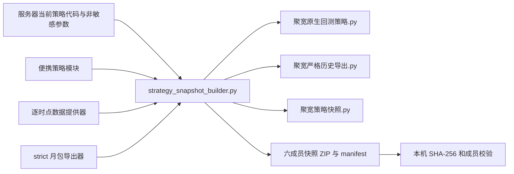

# 聚宽导出器开发与维护手册

> 本文是修改聚宽策略快照、原生回测脚本、严格历史导出器及上传链路前的必读文档。普通导出操作请阅读[严格历史数据三步说明](strict_history_three_step_guide.md)；数据包契约和用户排错请阅读[严格历史数据导出完整手册](joinquant_strict_history_export_manual.md)。

## 先确认这些边界

- 聚宽最终运行环境按 Python 3.6 兼容处理。仓库里的构建器可以使用服务器 Python，但生成的三个便携脚本不得依赖 `dataclasses`、`from __future__ import annotations`、内置泛型写法或 Python 3.7 以后才有的日期 API。
- 任一历史特征必须满足 `available_at <= decision_at`。不能通过改时间戳、用当日收盘、用未来日线或当前新闻倒灌历史来“修好”数据。
- `stock-analysis.env`、SSH 私钥、JoinQuant Token、Webhook、账户、持仓和数据库不得进入快照。生成、下载和部署都不得修改或轮换这些值。
- 本地构建通过不等于已部署，聚宽回测结束不等于策略已验证。状态必须分别写为 `implemented`、`deployed`、`observed`、`validated`。
- 当前工作区可能包含尚未提交的 P1 或多路径因子改动。接手者必须先看 `git status --short`，不得覆盖或回退不属于本次任务的改动。

## 新窗口五分钟接管

在项目根目录依次执行：

```powershell
Get-Content -Encoding utf8 AGENTS.md
Get-Content -Encoding utf8 docs\project_roadmap.md
Get-Content -Encoding utf8 docs\project_handoff.md
Get-Content -Encoding utf8 docs\joinquant_exporter_development_manual.md
git status --short --branch
rg -n "BUILDER_VERSION|SNAPSHOT_RUNTIME_VERSION|PIT_ENGINE_VERSION|EXPORTER_VERSION|STRICT_EXPORT_SCRIPT_VERSION|NATIVE_BACKTEST_VERSION" strategy_snapshot_builder.py strategy_snapshot_runtime.py joinquant_point_in_time.py joinquant_strict_history_exporter.py
```

然后先运行最小基线测试：

```powershell
python -m py_compile strategy_snapshot_builder.py strategy_snapshot_runtime.py joinquant_point_in_time.py joinquant_strict_history_exporter.py
python -m unittest tests.test_strategy_snapshot_builder tests.test_strategy_snapshot_runtime tests.test_joinquant_point_in_time tests.test_joinquant_strict_history_exporter tests.test_strategy_snapshot_script -v
```

如果基线失败，先记录原始错误和当前工作区，不要把已有失败误算成本次改动，也不要为了让测试变绿而放宽反前视或哈希校验。

## 代码如何生成两个聚宽脚本



| 文件 | 唯一职责 | 修改时必须联动 |
| --- | --- | --- |
| `strategy_snapshot_builder.py` | 冻结安全参数、拼装单文件、生成确定性 ZIP、校验成员和快照身份 | 源文件清单、便携拼接清单、版本矩阵、构建器测试 |
| `strategy_snapshot_runtime.py` | 便携决策契约、拒绝原因、组合状态、严格候选构建入口 | PIT 引擎、必需特征、运行时测试 |
| `joinquant_point_in_time.py` | 只用决策时点可见数据重建股票池、日线、5 分钟行情、行业和组合 | 特征 schema、数据版本、反前视测试 |
| `joinquant_strict_history_exporter.py` | 按月导出 strict 六表、D+10 价格路径、哈希与 ZIP | 导入器、表契约、容量上限、strict 测试 |
| `factor_contracts.py` 等便携因子模块 | 多路径因子、候选通道、精确费用和退出规则 | `PORTABLE_FACTOR_SOURCE_FILES`、`STRATEGY_SOURCE_FILES`、Python 3.6 AST 测试 |
| `scripts/strategy_snapshot_download.ps1` | 经 SSH 请求服务器构建、下载、复核并原子发布到 `output/` | CMD 入口测试、连接配置格式、失败不覆盖规则 |
| `strict_history_ingest.py` | 服务器端验证并原子导入 strict ZIP | manifest/schema、数据库备份和导入测试 |

生成脚本不是手工维护副本。任何策略或导出器修改都应先改上述源文件，再由构建器重新生成；不要把聚宽 Notebook 中的旧代码复制回来覆盖仓库。

## 不可破坏的开发契约

### 保持 Python 3.6 兼容

仓库侧的 `strategy_snapshot_builder.py` 可以使用现代 Python；被拼入聚宽文件的模块必须兼容 Python 3.6。

便携模块禁止使用：

```python
from __future__ import annotations
from dataclasses import dataclass
value: list[str]
value: str | None
datetime.fromisoformat(text)
```

需要结构化记录时使用普通类、命名元组或字典；类型注解使用 `typing.List`、`typing.Optional`，或在便携层不写运行时注解。构建测试必须对三个生成成员执行 `ast.parse(..., feature_version=(3, 6))`，并模拟聚宽 Notebook 缺少 `dataclasses` 的环境。

生成文件开头只能包含注释、普通导入和代码。不要把 `from __future__` 放到拼接模块中；多个模块拼成一个文件后，它不再位于文件真正开头，会再次触发此前的 SyntaxError。

### 严格防止未来数据

数据可用时间以带时区 ISO 时间保存。核心规则为：

```python
if available_at > decision_at:
    raise StrictExportError("FEATURE_FROM_FUTURE")
```

- 5 分钟数据只使用决策时点前已经闭合的 K 线。
- MA、ATR、支撑压力和形态因子只使用决策日前完整日线。
- 估值使用上一完整交易日，行业查询必须传历史日期。
- 同日新闻没有可证明的盘中发布时间时保持中性，不得倒灌。
- 原生回测的订单在下一决策时点镜像；卖出仍受聚宽 `closeable_amount` 和 T+1 限制。
- 测试数据若包含晚于决策时点的 bar，正确行为是拒绝测试数据，不是放宽代码。

### 正确处理 `prev_close`

此前真实整月运行曾因 `INVALID_NUMBER: prev_close` 失败。现在的处理顺序是：

1. 优先使用来源行里真实、有限、为正的 `pre_close`。
2. 缺失时，从同一股票更早的真实日线 `close` 有界回看。
3. 跳过 NaN、无穷值、零和负数。
4. 仍无法取得时，记录有界审计并排除该股票日。

绝对禁止用当日 `close`、下一日数据、当前分钟价格或固定常数补造前收盘。聚宽批量 `get_price` 字段并不稳定支持 `pre_close`，不要仅为这个字段向批量分钟接口加一个未经验证的请求列；保持独立回退路径和对应测试。

### 保持快照身份和敏感信息隔离

快照身份由安全参数、源文件 SHA-256、PIT/strict/因子代码哈希共同决定。六成员包必须逐成员记录 `sha256` 和 `size`，本机发布前再次校验。

新增会影响策略结果的源文件时，必须同时加入：

- `STRATEGY_SOURCE_FILES`：让活动服务/工作区状态和源码哈希可见。
- `PORTABLE_FACTOR_SOURCE_FILES`：仅当该文件需要被拼进聚宽单文件时加入。

快照保留上限为 24 个不同包，单个快照包上限为 20 MB；strict 月包当前上限为 3 GB。不得用关闭容量保护来绕过问题。运行产物只进入 `cache/` 或 `output/`，不得写到仓库根目录。

## 修改一种功能时要改什么

| 改动类型 | 代码联动 | 版本联动 | 必测范围 |
| --- | --- | --- | --- |
| 候选、买卖、仓位或因子语义 | runtime、PIT、原生回测镜像、strict 候选、训练特征 | runtime、PIT、feature schema、strategy/parameter identity | runtime、PIT、builder、strict、因子测试 |
| 只改聚宽历史取数 | PIT 或 strict source | PIT market data 或 exporter version | 反前视、缺字段、NaN、整月小样本 |
| strict 表字段或 manifest | exporter、ingest、history schema/contract | exporter、schema/adjustment version | exporter、ingest、哈希、幂等导入 |
| 生成包成员或拼接顺序 | builder、PowerShell 解包 | builder version | 确定性 ZIP、成员集合、Python 3.6 AST、敏感扫描 |
| 桌面一键脚本 | PowerShell 和 CMD | 通常不改策略版本 | `-ValidateOnly`、失败不覆盖、路径白名单 |
| 文案或用户步骤 | 三步说明、完整操作手册 | 不改策略版本 | 路径、文件名和实际 UI 口径人工复核 |

版本号不是装饰。行为变化后至少检查这些常量是否需要更新：

```text
BUILDER_VERSION
SNAPSHOT_RUNTIME_VERSION
PIT_ENGINE_VERSION
PIT_FEATURE_SCHEMA_VERSION
PIT_MARKET_DATA_VERSION
EXPORTER_VERSION
ADJUSTMENT_VERSION
NATIVE_BACKTEST_VERSION
STRICT_EXPORT_SCRIPT_VERSION
```

不要只改最外层脚本版本而遗漏内核或 schema。最终以 `snapshot_id`、`parameter_version`、`code_hash` 和包 SHA-256 四者共同识别一次可复现交付。

## 已发生问题与防回归路径

| 证据/错误 | 结论 | 固定处理路径 |
| --- | --- | --- |
| `from __future__ imports must occur at the beginning` | 旧代码残留或便携模块带有 future import | 新建干净单元格；源文件移除便携层 future import；重生成完整脚本；运行 Python 3.6 AST 测试 |
| `ModuleNotFoundError: dataclasses` | 聚宽 Python 3.6 环境加载了仓库侧写法 | 便携层改普通类/字典；重生成；执行无 dataclasses 模拟测试 |
| `INVALID_NUMBER: prev_close` | 前收盘证据缺失或 NaN | 按 `pre_close`→更早真实 close→审计排除处理；禁止未来/当日补值；运行 NaN 回归测试 |
| `FEATURE_FROM_FUTURE` / `FACTOR_BAR_FROM_FUTURE` | 输入时间晚于决策时间 | 修数据来源、bar 截止或测试夹具；不得改时间戳绕过 |
| `D10_PRICE_HORIZON_NOT_MATURE` | 月份之后没有足够 10 个交易日 | 等数据成熟或选择更早月份；不缩短标签窗口 |
| `TABLE_HASH_MISMATCH` / `FILE_HASH_MISMATCH` | ZIP 被改动、下载不完整或契约不一致 | 丢弃损坏副本，重新生成/下载；不要强制导入 |
| `ACTIVE_SOURCE_NEWER_THAN_SERVICE` | 服务器文件比当前进程实际加载版本更新 | 停止生成；只有在明确授权和非交易时段完成受控重启后再生成 |
| Notebook 文件列表仍显示“运行中” | Kernel 会话未释放或前台任务仍存在，不等于导出成功 | 以单元格出现 `STRICT_EXPORT_OK` 和 ZIP 为成功标准；需要时保存后重启研究环境 |
| 研究环境内存不足 | 单月 48 时点和 D+10 路径占用较高 | 一次只跑一个月；运行前重启 Kernel；保留行数/包大小上限 |
| 桌面 CMD 双击无结果 | CMD/PowerShell 路径、编码或本机配置异常 | 先运行 PowerShell `-ValidateOnly`；不得把密钥或服务器地址硬编码进 CMD |

## 当前优化账本

截至 2026-08-10，本地代码已经包含以下防回归能力：

- 两份聚宽脚本由同一个确定性快照生成，共享策略、参数、特征和源码身份。
- 便携 strict 导出器移除了 `dataclasses`、future annotations 和 `datetime.fromisoformat` 依赖。
- 每个候选特征都带 `available_at`，未来字段立即失败关闭。
- `prev_close` 会跳过 NaN 并只回看更早真实收盘；缺证据的股票日被审计排除。
- 原生回测使用 48 个闭合 5 分钟决策点、下一决策点下单、真实持仓和 T+1 可卖数量。
- strict 月包保存候选选中/拒绝、稳定拒绝代码、D+10 价格路径、文件哈希和表哈希。
- 一键脚本先确认服务器当前实际运行版本，再下载、校验和原子替换本机 `output/`；失败时不覆盖上一份有效文件。
- 多路径因子相关的便携模块已进入本地构建器源文件与拼接清单。2026-08-10 在 Windows 执行 `python -m unittest discover -s tests -v` 共发现 1060 项：1057 项通过；另 3 项仅因本机没有 Linux `bash` 而无法启动 `run_ubuntu.sh ledger-check`，没有导出器、策略或数据契约测试失败。该增量仍只能称为本地 `implemented / regression-tested`，不能称为已提交、已部署、已观察或已验证。

本节只记录低频架构优化。每次具体外部部署状态仍以主路线图和交接文档为准，不在这里保存 Token、服务器地址、实时运行结果或每天的导出统计。

## 完成开发后的验收

至少执行：

```powershell
python -m py_compile strategy_snapshot_builder.py strategy_snapshot_runtime.py joinquant_point_in_time.py joinquant_strict_history_exporter.py strict_history_ingest.py
python -m unittest tests.test_strategy_snapshot_builder tests.test_strategy_snapshot_runtime tests.test_strategy_snapshot_script -v
python -m unittest tests.test_joinquant_point_in_time tests.test_joinquant_strict_history_exporter tests.test_strict_history_ingest tests.test_strict_history_upload_script -v
```

涉及策略候选、因子或经济性时，再执行对应候选、导出和多路径测试；涉及数据库或持久化时，按[数据存储规范](data_storage_policy.md)补充容量、保留、备份恢复和幂等测试。

Windows 上执行全量发现时，`tests.test_joinquant_linux_script` 的 3 项用例必须在具有 `bash` 和 Linux 命令链的服务器/WSL 中验证。若错误均为启动 `bash` 时的 `FileNotFoundError`，应记录为环境边界，不能误报为业务代码失败；若出现断言失败或脚本已经启动后返回非预期状态，则仍按真实回归失败处理。

交付前逐项确认：

- 三个生成成员都能按 Python 3.6 语法解析，且不含 `dataclasses` 和便携层 future import。
- 同一输入连续生成的 ZIP 字节完全一致，成员集合、大小和 SHA-256 全部通过。
- 反前视、未来 bar、缺字段、NaN `prev_close`、T+1 和下一时点成交均有回归测试。
- 新策略文件已进入源码哈希清单；新便携文件已按正确顺序拼接。
- 用户操作手册中的文件名、月份修改位置和成功标志与生成代码一致。
- 未打印、复制或改动 SSH 私钥、Token、Webhook、`stock-analysis.env` 内容、账户或数据库。
- 未经当次明确授权，不执行 commit、push、服务器部署或服务重启。
- 若获准重启，先备份数据库并记录私有环境文件哈希，重启后只比对哈希是否一致，不输出其内容；任何变化都立即停止。

## 文档维护规则

出现以下任一情况时，同一次改动必须更新本文：

- 新增一种曾在聚宽真实运行中出现的错误。
- 便携 Python 版本、包成员、取数来源、反前视边界或 strict 表契约变化。
- 新增需要拼接进聚宽的策略/因子文件。
- 一键生成、下载、上传或服务器验证流程变化。
- 版本联动矩阵或最小测试命令变化。

新窗口只要遵循 `AGENTS.md` 的必读规则，就会从主路线图进入本文，并能看到历史问题、当前优化、修改矩阵和验收清单，不需要依赖上一段聊天记录。
