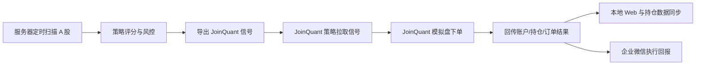

# A 股策略项目规划与状态

更新日期：2026-07-14

本文档是当前项目规划的唯一主说明，合并已有能力、JoinQuant 接入方案、服务器部署流程，以及后续机器学习优化路线。其他早期设计文档只作为历史参考；如果口径冲突，以本文档为准。

## 当前有效从文档索引

日常工作只把下表视为当前有效从文档。新电脑或新对话先读 `AGENTS.md`、本文和 `docs/project_handoff.md`，然后仅按任务范围读取相关从文档；`docs/archive/` 只用于追溯历史，不参与当前状态、阶段或优先级判断。

| 从文档 | 权威范围 | 当前用途与读取条件 |
| --- | --- | --- |
| `docs/project_handoff.md` | 新电脑、新对话和外部状态恢复 | 时间点快照；接管任务必读，服务器状态仍需重新验证。 |
| `docs/live_trading_execution_plan.md` | 模拟盘稳定性、完整历史回测、实盘级风控、交易适配和真实资金前门槛 | 涉及阶段推进、部署验收或实盘化时读取。 |
| `docs/codex_simulation_observation_plan.md` | Codex 定时只读审核、证据、报告和权限 | 涉及自动审查、服务器只读访问或阶段评估时读取。 |
| `docs/data_storage_policy.md` | 数据分类、增长、保留、轮转、备份恢复和敏感信息 | 任何新增或修改持久化数据时必读。 |
| `docs/superpowers/specs/2026-07-11-simulation-stability-ledger-design.md` | SQLite 账本、幂等、对账、安全和 20 日验证 | 涉及账本、订单/成交、对账或稳定性门槛时读取；Batch 1 与后续目标状态必须分开。 |
| `docs/superpowers/specs/2026-07-13-layered-exit-risk-management-design.md` | 当前买入、卖出、持仓周期、组合风险和安全降级规则 | 修改策略、交易、仓位、止盈止损或风险逻辑前必读。 |
| `docs/superpowers/plans/2026-07-13-layered-exit-risk-management.md` | 当前 Batch A-G 唯一实施、部署和观察顺序 | 执行或部署本地已实现风险能力时读取。 |
| `docs/superpowers/specs/2026-07-14-sqlite-backup-recovery-design.md` | SQLite 自动备份、7/4/12 轮转、恢复演练、告警和状态门槛 | 实现、部署或审核交易账本备份恢复时读取；当前本地 `implemented`，服务器未部署。 |
| `docs/superpowers/plans/2026-07-14-sqlite-backup-recovery.md` | SQLite 自动备份与恢复演练实施任务和验证命令 | 修改或部署备份恢复能力时读取；Tasks 1–5 本地 `implemented`。 |
| `docs/superpowers/plans/2026-07-14-complete-trading-ledger-reconciliation.md` | schema 6 完整成交账本、自动对账和人工解锁实施证据 | 修改订单、成交、快照、权益、对账或交易控制时读取；当前仅本地 `implemented`。 |
| `docs/superpowers/specs/2026-07-14-point-in-time-historical-backtest-design.md` | strict/price_core 双轨逐日时点历史回测、反前视和撮合证据边界 | 修改完整历史回测、walk-forward、历史数据质量或 Batch G 回测门槛时读取；当前仅本地 `implemented`。 |
| `docs/superpowers/plans/2026-07-14-point-in-time-historical-backtest.md` | 独立历史库、候选生成、逐日撮合、指标、CLI和验证任务 | 实现或核验完整历史回测时读取；框架本地已实现，真实严格数据运行尚未观察或验证。 |
| `docs/superpowers/specs/2026-07-14-semi-automatic-parameter-review-design.md` | 参数候选、准入、人工批准、版本和回滚治理 | 设计参数复核或机器学习与参数边界时读取；当前为 `planned`。 |
| `docs/superpowers/plans/2026-07-14-semi-automatic-parameter-review.md` | 半自动参数复核未来实施任务 | 数据与前置门槛满足后执行；当前为 `planned`。 |

归档索引见 `docs/archive/README.md`。归档文档不得覆盖本表中的活跃文档，也不作为开始任务的默认必读资料。

稳定性账本 Batch 1 当前状态为“代码已实现并部署服务器、待部署后首个有效交易日双写观察”；2026-07-12 只读核验确认服务器、本地代码当时均为 `54eaaf423f690dda84776304c4ec87846aa8cf66`，SQLite schema version 为 1 且空信号一致。此历史检查点不能替代当前服务器复核。

## 2026-07-14 本地实现基线

本地提交 `9f4c12d` 已包含下列 `implemented` 能力，但尚未推送或部署：全 JoinQuant 持仓硬止损覆盖、板块/ATR 初始止损、账户风险定仓、+2R 按100股单位降至初始半仓、首段止盈后的移动止盈、短线3个/中线10个交易日时间止损，以及 `CAUTION` 减半风险仓位和 `RISK_OFF` 禁止新买入。卖出动作使用稳定持仓周期 ID，且优先覆盖同股买入。

SQLite 本地 schema 已升至 version 6：除 schema 5 的持仓周期、委托事件、退出意图和冷却外，新增正式订单、不可变逐笔成交、账户摘要、压缩持仓检查点、日权益、对账批次/差异项和控制审计。回调先事务入账和自动对账，成功后才发布兼容 JSON；`ERROR` 停止新买入，`CRITICAL` 追加 `KILL_SWITCH`，只有两个不同新鲜快照的全量一致对账及人工二次确认才允许恢复。在线备份、校验、7/4/12轮转和恢复演练已把 schema 6 核心表纳入。本批已随 `9f4c12d` 本地提交，但尚未推送或安装到服务器，因此是 `not deployed / not observed / not validated`。

JoinQuant 信号 JSON 继续使用兼容的 schema version 1，并增加可选 `target_qty`；本地网站模板期望版本为 `2026-07-14.1-ledger-v6`，并回传 `get_trades()` 逐笔成交。服务器仍以最近只读确认的 `aa9acffaf62239e39c076408d83d113dce22b029`、SQLite schema version 1 和旧网站模板为准；Git、服务器和 JoinQuant 外部状态都必须重新核验。本地测试不构成 `deployed / observed / validated`。

2026-07-13 用户确认调整实施策略：执行安全、旧持仓迁移、真实组合买入风控、买入可交易性、市场状态滞后和冷却机制一次补齐。上述代码和自动化测试现已在本地 `implemented`，包括行业25%、题材20%、无分类单票10%、连续亏损交易日冻结、真实成交换手/日内盈亏/账户回撤回传、未完成买单风险占用、评分优先分配、JoinQuant下单前复核，以及买卖两侧陈旧行情和异常价保护；各模块有独立环境开关。仍保持 `not deployed / not observed / not validated`。唯一详细计划为 `docs/superpowers/plans/2026-07-13-layered-exit-risk-management.md`。
阶段门槛分为两层：阶段 1 基础系统稳定性按连续 10 个有效交易日验收；专项设计中的 20 个有效交易日用于完整账本加固与策略验证。达到 10 日门槛不等于完成 20 日专项验证，两者均不得以代码实现或非交易日静态检查替代。

Batch G 参数复核采用“自动分析、人工批准、显式发布、版本化回滚”，专项设计和实施计划分别见 `docs/superpowers/specs/2026-07-14-semi-automatic-parameter-review-design.md` 与 `docs/superpowers/plans/2026-07-14-semi-automatic-parameter-review.md`。当前已有样本、部分标签、策略对照、信号级回测、逐日历史回测框架和 `parameter_version` 基础；候选登记、评价准入、人工决定、激活和回滚均为 `planned / not implemented / not deployed / not observed / not validated`。20 个有效交易日只允许开始数据复核，候选进入可批准列表还需要可用 strict 历史 walk-forward 证据加 20 个有效模拟盘交易日；缺少该证据时替代门槛为至少 60 个有效模拟盘交易日。任何自动任务和 Codex 只读审核员都无权批准或改变活动参数。

Codex 仍只允许只读观察、阶段评估和优化建议；数据持久化仍必须同时定义增长、保留、轮转、备份恢复和敏感信息处理。详细约束按上表读取对应从文档。

## 状态说明

- 已实现：代码或脚本已经落地，并通过现有测试或语法检查。
- 部分实现：核心能力已经有，但还缺少线上验证、运维加固或长期数据积累。
- 待实现：已明确方向，但还没有写入代码。
- 已废弃：代码可能仍为兼容或测试保留，但不再作为当前方案继续演进。
- 暂不启用：代码可能仍保留，但默认关闭，不作为当前主流程。

## 当前主流程

当前推荐流程是：服务器本地程序负责选股、打分、生成目标仓位和发送信号；JoinQuant 模拟盘负责实际模拟下单；JoinQuant 再把账户、持仓、订单执行结果回传到服务器；企业微信分别推送信号计划和执行回报。

## 已完成能力

| 模块 | 状态 | 说明 |
| --- | --- | --- |
| A 股数据扫描与策略评分 | 已实现 | 现有策略会生成候选、分数、风险参数和目标仓位。 |
| 企业微信基础推送 | 已实现 | 支持策略报告、JoinQuant 信号计划、JoinQuant 执行回报。 |
| JoinQuant 信号导出 | 已实现 | 本地策略会导出 JoinQuant 可读取的买卖信号。 |
| JoinQuant 信号服务 | 已实现 | 提供信号拉取接口和账户快照回调接口。 |
| JoinQuant 策略模板 | 已实现 | JoinQuant 平台运行 `joinquant_strategy.py`，默认使用模拟盘真实下单模式，不是 dry-run。 |
| JoinQuant 执行回报 | 已实现 | 完整订单事件会通过回调进入服务器并落盘；只有 `buy/sell` 且 `filled > 0` 的实际成交会推送微信，零成交、失败和跳过不推送。 |
| JoinQuant 持仓同步 | 已实现 | 本地持仓展示读取 JoinQuant 回传结果，作为模拟盘主数据来源。 |
| 全持仓硬止损信号 | 已实现 | 每轮使用全市场实时价检查全部 JoinQuant 同步持仓；持仓即使未进入候选池，跌破既有止损价也会生成卖出信号。本地代码和测试已完成，服务器部署及真实交易日卖出证据仍待确认。 |
| JoinQuant 健康检查与异常报警 | 已实现 | `joinquant_health.py` 会检查信号文件、账户快照、API 拉取/回传次数、失败原因、持仓一致性、JoinQuant 网站模板版本和稳定性评分，生成 `output/joinquant_health_YYYYMMDD.md`；非交易时段的信号/快照过期只记录报告，不刷微信报警。 |
| 企业微信失败重试 | 已实现 | 推送失败会进入 `cache/notify_failed_queue.jsonl`，`notify_retry.py` 和 `stock-notify-retry.timer` 会定时重试。 |
| 节假日推送静默 | 已实现 | 非 A 股交易日默认不推普通扫描、买点提醒和 JoinQuant 空计划；可用 `NOTIFY_NON_TRADING_DAY=1` 临时打开联调。 |
| 盘后信号追踪复盘 | 已实现 | 对已推送信号记录推送价、入场/止损/止盈、分数、题材和市场状态；盘后补充 D+N 快照、高低收、入场、止盈止损、最大浮盈、最大回撤和策略质量分组。 |
| 本地信号级回测 | 已实现第一版 | `backtest_engine.py` 可读取 `cache/ml/signal_samples.jsonl` 或 `cache/joinquant/signals.json`，模拟信号买卖、手续费、印花税、T+1、止盈止损和仓位限制，输出 `output/backtest_report.md` 与 `output/backtest_trades.csv`。 |
| ML 样本采集与基础复盘 | 部分实现 | 已采集 JoinQuant 信号样本、回填订单执行标签、生成基础复盘报告；多日收益标签和模型训练未启用。 |
| Linux 一键部署脚本 | 已实现 | 当前统一使用 `run_ubuntu.sh`，旧的拆分脚本已删除。 |
| 本地模拟盘 | 已废弃 | 代码仍为兼容和历史测试保留，但默认关闭，不再作为当前模拟交易方案；主模拟盘只认 JoinQuant。 |
| 本地模拟盘交易时间限制 | 已废弃 | 该限制只服务旧本地模拟盘，当前不会参与主流程。 |
| 单元测试 | 已实现 | 覆盖 JoinQuant 信号服务、策略模板、同步逻辑等关键路径；本地模拟盘相关测试仅保留历史兼容性。 |

## JoinQuant 接入路线

| 阶段 | 状态 | 目标 |
| --- | --- | --- |
| 1. 信号契约 | 已实现 | 本地统一生成 `buy`、`sell`、目标仓位、止盈止损等字段。 |
| 2. 本地 API 服务 | 已实现 | JoinQuant 通过 token 拉取信号，并把账户快照 POST 回本地。 |
| 3. JoinQuant 模拟下单 | 已实现 | JoinQuant 策略根据本地信号在模拟盘执行下单。 |
| 4. 微信区分推送 | 已实现 | 当前主推 JoinQuant 模拟盘和执行回报；本地模拟盘标记只为废弃功能保留，默认不会推送。 |
| 5. 手机微信展示优化 | 已实现 | 执行结果按短段落、状态、原因、数量、价格展示，适配手机阅读。 |
| 6. 服务器完整部署 | 部分实现 | 核心扫描、JoinQuant 信号、持仓 Web 服务及现有定时器已部署；公网 HTTPS、反向代理、HMAC、防重放等生产安全加固仍未确认或待实现。 |
| 7. 线上稳定性观察 | 观察中 | 旧版 JoinQuant 拉取与快照链路已有真实交易日证据；当前 SHA 的 SQLite Batch 1 尚未经历部署后的首个有效交易日双写观察，阶段 1 尚未 validated。 |
| 8. 实盘前检查清单 | 部分实现 | 已有 readiness 报告和健康检查报告；后续需要加入实盘级风控、交易适配层和审计清单。 |

## JoinQuant 可执行信号规则

- 买入信号只在 A 股交易日交易时间内导出给 JoinQuant 执行，非交易时间只作为观察和微信提醒，不进入模拟盘下单。
- 当前可执行交易时间按连续竞价口径处理：`09:30-11:30`、`13:00-15:00`。`09:15-09:29` 属于盘前/集合竞价观察，不再标记为盘中，也不会导出买入下单。
- 买入信号要求当前价已经达到或高于建议入场价，且涨幅低于 9.8%，避免未到确认位或接近涨停时追入。
- 如果止盈价不高于建议入场价，微信单股提醒和盘中汇总都会显示为“无有效空间”，且不会导出 JoinQuant 买入信号。
- 卖出信号必须先确认 JoinQuant 同步持仓里已有该股票；未持仓股票即使出现止损、止盈、超时等卖出类风控标记，也不会导出卖出计划。
- 硬止损检查覆盖全部 JoinQuant 同步持仓，不要求持仓股票先进入当轮候选池；优先使用当轮全市场实时价，缺失时回退到同步持仓现价，并只沿用既有持仓止损价。
- 卖出信号由服务器每轮风控重新判断；只有最新 `signals.json` 里仍然存在卖出信号时，JoinQuant 才会尝试卖出。
- JoinQuant 不维护历史计划队列，只拉取服务器最新信号；如果风控解除、服务器不再导出卖出信号，JoinQuant 不会凭旧计划继续卖。
- JoinQuant 执行前仍会检查信号新鲜度、是否重复、是否已持仓或无持仓；实际成交、T+1、停牌、涨跌停、休市由 JoinQuant 模拟盘撮合环境处理。

## 微信推送与节假日规则

- 非 A 股交易日默认静默：不推普通扫描、不推买点提醒、不推 JoinQuant 空计划。
- 交易日盘前只做观察摘要，不导出 JoinQuant 买入计划。
- 交易日盘中允许买点提醒、JoinQuant 买卖计划和执行回报。
- 交易日午休默认不推送，常驻模式会等待下一阶段。
- 交易日盘后只推复盘和信号追踪复盘，不推买点下单计划。
- `NOTIFY_NON_TRADING_DAY=1` 只用于服务器联调，开启后非交易日也会推送。
- `A_SHARE_HOLIDAYS=YYYY-MM-DD,YYYY-MM-DD` 用于补充法定节假日；周末会自动按非交易日处理。
- JoinQuant 健康检查每 5 分钟生成报告；盘外或节假日如果只是信号/账户快照未更新，不会反复推送“异常”，避免非开盘时间刷屏。

## 盘后信号追踪复盘

当前追踪范围是“微信成功推送过的信号”，数据保存在 `cache/signal_watchlist.json`。每条信号会记录：

- 推送价、建议入场、止损、止盈、仓位。
- 模式、总分、交易分、市场状态、题材和题材热度。
- 推送时间、信号 ID、买点状态和推送理由。

盘后复盘会基于最新行情补充：

- 当日最高、最低、收盘价。
- 是否已入场、是否触及止盈、是否触及止损。
- 单只信号的最大浮盈、最大回撤和收盘收益。
- 汇总统计：今日跟踪数量、已入场、未入场、止盈、止损、平均最大浮盈、平均最大回撤。
- D+N 追踪快照：每次盘后复盘会把当日收盘、高、低、收益和结果追加到 `review_history`。
- 策略质量分组：按模式、题材热度、市场状态输出轻量胜率和平均收益，用于判断哪些信号更有效。

后续更严格的 `D+1/D+3/D+5/D+10` 交易日收益标签、最大区间浮盈浮亏和模型训练样本，会继续并入机器学习标签阶段。

## 本地信号级回测

第一版回测用于评估“已经生成过的信号如果按规则执行，收益和回撤大概如何”，不重新拉取历史新闻、题材或全市场行情。

- 执行入口：`bash run_ubuntu.sh backtest` 或 `python backtest_engine.py`。
- 默认输入：优先读取 `cache/ml/signal_samples.jsonl`，没有样本时读取 `cache/joinquant/signals.json`。
- 输出文件：`output/backtest_report.md` 和 `output/backtest_trades.csv`。
- 已模拟规则：信号买入/卖出、目标仓位、单票仓位上限、总仓位上限、手续费、印花税、T+1、止盈、止损、涨停不可买和跌停不可卖的预留字段。
- 报告指标：初始资金、期末权益、总收益、最大回撤、交易次数、胜率、未平仓数量和最近交易。
- 支持天数：理论上不限，实际等于输入文件里已经积累的信号天数；如果只有今天的 `signals.json`，就只能回测今天这一批信号，如果 `signal_samples.jsonl` 积累了 30/180 个交易日，就能覆盖对应区间。

该模块不替代 JoinQuant 模拟盘。它主要服务策略复盘和机器学习样本评估；逐日历史回测已由下节的独立框架承接。

### 本地已实现框架：完整历史回测

完整历史回测的目标是回答“如果过去 6 个月或 1 年每天都按当前策略扫描全市场，最终收益和回撤如何”。它和当前信号级回测不同，需要重建历史环境：

- 历史交易日循环：按每个 A 股交易日逐日运行。
- 历史数据导入：通过 JoinQuant/AkShare CSV 映射导入当日开高低收、成交额、涨跌停、停牌和时点特征；框架不联网下载数据。
- 历史候选重建：strict 模式读取当时可用的完整特征快照，price_core 只运行明确标记的价格核心代理规则。
- 历史撮合：默认使用 T 日收盘决策、T+1 开盘成交，并遵守 T+1、手续费、印花税、涨跌停和仓位限制。
- 结果输出：净值曲线、交易明细、收益、最大回撤、胜率、盈亏比、分数分组表现和市场状态分组表现。

本地已实现独立 `cache/backtest/history.db`、JoinQuant/AkShare CSV 映射、幂等冲突检查、`strict`/`price_core` 质量门、T 收盘决策与 T+1 开盘撮合、复权连续性、费用/滑点/涨跌停/停牌、分层退出、绩效分组、三个 walk-forward 窗口、参数比较契约、CLI、原子报告和手动 Linux 入口。现有 `backtest_engine.py` 信号级回测保持独立兼容。

状态必须保持为：框架已在本地提交 `9f4c12d` 并为 `implemented`，但尚未推送或部署；没有真实 6 个月/1 年数据集通过严格质量门并重复运行，所以是 `not deployed / not observed / not validated`。`price_core` 固定标记 `proxy_only=true`，只能验证价格、撮合和退出机制，不能满足 Batch G 的完整历史回测准入。

## 当前部署原则

- 服务器只部署本项目，不需要把 JoinQuant 网站部署到服务器。
- `joinquant_strategy.py` 复制到 JoinQuant 网站的策略编辑器中运行。
- 服务器通过 `run_ubuntu.sh` 启动本地扫描、Web、JoinQuant 信号服务和定时任务。
- 企业微信 webhook 和自定义 token 统一通过 `run_ubuntu.sh install --webhook ... --token ...` 写入服务器配置。
- 代码统一托管在 GitHub：`https://github.com/yuyang0702/stock-analysis.git`。后续本地改完代码后先 `git add .`、`git commit`、`git push`；服务器进入 `/opt/stock-analysis` 后执行 `git pull origin main`，再用 `run_ubuntu.sh` 菜单重启服务。
- 服务器目录固定为 `/opt/stock-analysis`；如果首次切换到 GitHub 版本，先把旧目录备份成 `stock-analysis.bak.YYYYMMDD-HHMMSS`，再 `git clone` 到新的 `stock-analysis` 目录。
- `stock-analysis.env` 和 `cache/` 不上传 GitHub，分别保存服务器私有配置和运行数据；重新 clone 时需要从备份目录复制回来，日常 `git pull` 不会覆盖它们。
- 本地模拟盘已废弃并默认关闭，避免和 JoinQuant 模拟盘产生双账户混淆。

## 机器学习优化方案

目标：基于每次策略信号、JoinQuant 实际成交结果、持仓收益表现，逐步评估选股排序、买卖过滤和仓位建议。机器学习模型与固定策略参数分开治理：模型路线负责预测、排序和过滤，Batch G 负责在预设安全区间内复核确定性策略参数。

第一阶段不让机器学习直接自动交易，只做影子评分和复盘报告。未来训练模型即使通过离线评价，也必须先登记模型版本、进入影子观察、经用户人工批准，并在单独授权的任务中发布；不能因为定时训练或报告通过而自动接入仓位、信号过滤或下单。

### 机器学习与参数复核的关系

- ML-1 至 ML-7 是模型数据、训练、影子观察和策略辅助路线；当前只有数据与规则型影子评分，没有训练模型。
- ML-8/Batch G 是参数治理路线，首版使用确定性、有界候选搜索和时间切分评价，不要求也不等于机器学习训练。
- 将来模型可以只读提出参数候选或排序建议，但不能写入批准、激活、部署或回滚状态。
- 模型版本和参数版本必须分别记录；任何信号都要能追溯当时的代码版本、模型版本和参数版本。
- 无论是模型还是参数，自动化最多生成候选与证据；人工批准、显式发布、模拟盘观察和版本化回滚是共同门槛。

### 当前进度快照

当前机器学习模块还处在“数据采集 + 影子评分 + 复盘统计 + 信号级回测基线”阶段，没有训练模型，也没有让模型影响买入、卖出、仓位或 JoinQuant 下单。

已完成：

- 生成 JoinQuant 信号时，会把信号样本追加到 `cache/ml/signal_samples.jsonl`。
- `shadow_score.py` 会基于原策略分、消息催化、题材热度、板块位置、市场情绪、交易质量和海外风险生成 `enhanced_score`、`shadow_adjust_score`、`original_rank`、`shadow_rank`、`shadow_rank_change` 和 `shadow_reason`，只用于对照复盘。
- 板块行情改为独立低频刷新：`a_share_strategy.py --sector-context-only` 或 `bash run_ubuntu.sh sector-context` 会通过 AkShare 东方财富行业/概念板块行情刷新 `cache/market/sector_context.json`；日常扫描只读取该缓存，不在每轮扫描时主动请求板块接口。刷新失败时优先保留最近成功缓存，没有缓存才按板块中性处理并在依据里提示失败原因。
- `global_market_context.py` 会通过 AkShare 东方财富主源抓取美股、日本、韩国主要指数并写入 `cache/market/global_context.json`；主源失败时切到 Sina 备用源，备用源也失败时优先复用 24 小时内最近一次成功缓存，仍不可用才按海外风险中性处理，不阻塞扫描。
- 日常微信扫描汇总、单票提醒和 JoinQuant 下单计划会显示原策略分、影子分、影子调整和原排名到影子排名的变化；影子分不是百分制，允许超过 100，只用于观察，不参与下单。
- JoinQuant 执行链路已增加可成交性与健康保护：买入信号导出前按账户总资产、目标仓位和入场价检查是否至少够买 100 股，不够一手时记录 `buy_too_small_for_board_lot` 并不下单；订单状态在快照回传前统一转成字符串，避免 `OrderStatus` JSON 序列化失败；普通 `skipped` 仍保留在原因明细中但不计入硬失败阈值；`JOINQUANT_ENFORCE_HEALTH_GATE=1` 时健康准入不通过只禁止新买单，卖出仍允许。
- JoinQuant 网站模板会在交易时间每次 `handle_data` 执行后回传账户快照，因此成交后的现金、总资产和持仓通常会在下一分钟快照中更新；服务器每 60 秒同步该快照到本地持仓。无订单的周期快照只用于账户同步；只有 `buy/sell` 且 `filled > 0` 的完整或部分成交才发送企业微信执行回报，零成交、失败和跳过不推送。
- JoinQuant 回传订单后，会把订单状态、失败原因、订单号、数量、成交量和价格回填到样本中。
- `ml_dataset.py` 可生成 `output/ml_signal_review.md`，用于查看样本数、买卖数量、订单状态、原策略分布和影子评分分布。
- `strategy_compare_report.py` 会补充 D+1/D+3/D+5、最大浮盈、最大回撤、止盈止损触发标签，生成 `output/strategy_compare_report.md`；每日盘后生成本地报告，每周五推送策略对照微信摘要。
- `backtest_engine.py` 可用已积累的信号样本做信号级回测，形成后续模型训练前的基线。

尚未完成：

- D+10、组合级回撤、完整盈亏比等长期标签仍待补齐。
- 完整历史回测框架已经实现，但还没有真实 strict 数据集运行、重复性证据和人工验证；信号级回测仍只覆盖已经生成过的信号。
- 还没有训练任何机器学习模型，也没有 `ml_score` 参与排序、过滤、仓位或下单。
- 还没有半自动参数复核与版本化发布；现有统计不会生成可批准候选，也不会自动改变参数。后续必须先通过数据就绪、时间切分回测、模拟盘对照和人工批准。

| 阶段 | 状态 | 说明 |
| --- | --- | --- |
| ML-1 样本采集 | 已实现 | 每次导出 JoinQuant 信号时，把当时的特征、策略分数、市场状态、目标动作追加到 `cache/ml/signal_samples.jsonl`。 |
| ML-2 成交与收益标注 | 部分实现 | 订单执行标签已回填；`strategy_compare_report.py` 会补 D+1/D+3/D+5、最大浮盈、最大回撤、止盈止损触发；D+10 和组合级标签待补齐。 |
| ML-3 复盘报表 | 已实现 | 可生成 `output/ml_signal_review.md` 和 `output/strategy_compare_report.md`，统计样本、订单状态、原策略分布、影子评分分布和策略对照结果；不训练模型、不参与下单。 |
| ML-4 信号回测 | 已实现第一版 | 基于已生成信号输出收益、回撤、胜率和交易明细，为后续模型训练提供对照基线；与 ML-5 的逐日历史框架保持独立。 |
| ML-5 完整历史回测 | implemented（仅本地框架） | 独立历史库、strict/price_core 双轨、逐日撮合、walk-forward、指标、CLI和报告已实现；真实 6 个月/1 年严格数据尚未导入，故未部署、观察或验证。 |
| ML-6 影子模型 | 已实现第一版 | 当前不是训练模型，而是规则型影子评分；已纳入消息催化、题材热度、板块位置缓存、市场情绪、交易质量和海外风险；`enhanced_score = final_score + shadow_adjust_score`，不再按 100 封顶，并输出原排名、影子排名和排名变化；板块位置由独立 timer 低频刷新，扫描只读最近成功缓存；不影响真实下单，用来和原策略做对照。 |
| ML-7 训练模型与策略辅助 | 待实现 | 训练模型先只输出版本化 `ml_score` 并进入影子观察；通过门槛和人工批准后，才可在独立授权任务中逐步用于排序、过滤或小幅仓位调整。止损、卖出安全、单票/行业/题材/总仓位和开放风险硬上限仍由规则控制。 |
| ML-8 半自动参数复核 | 待实现 | 这是与训练模型分离的参数治理能力。自动任务只生成有界候选、时间切分评价和准入报告；候选必须绑定版本与哈希，由用户明确批准并在独立授权任务中发布到 JoinQuant 模拟盘。禁止自动批准、自动改参、自动部署或进入真实资金；详细门槛见 2026-07-14 专项设计。 |

### 计划采集的特征

信号生成时记录以下数据，形成后续训练样本：

- 股票代码、信号日期、动作类型、目标仓位、当前持仓比例。
- 综合分、影子增强分、交易分、新闻分、风险收益比、压力位距离。
- 涨跌幅、成交额、换手率、均线、ATR、波动率等技术指标。
- 市场状态、题材热度、行业或概念标签、海外风险分。
- 策略给出的买入价、止损价、止盈价、仓位建议。

### 计划补充的结果标签

JoinQuant 回传后补充以下标签：

- 订单状态：已提交、部分成交、全部成交、失败、跳过。
- 失败原因：涨停、停牌、休市、余额不足、风控限制、接口异常等。
- 成交数量、成交价格、成交时间。
- 持有 1 日、3 日、5 日收益已由 `strategy_compare_report.py` 补充；10 日收益待补齐。
- 最大浮盈、最大浮亏、是否触发止损、是否触发止盈。
- 单笔净收益、组合回撤、胜率和盈亏比。

### 机器学习保护规则

- 禁止使用未来数据训练当前信号，训练集和验证集必须按时间切分。
- 样本不足时只生成统计报告，不上线模型。
- 机器学习不能绕过硬风控：单票仓位上限、总仓位上限、止损规则必须保留。
- 新模型先进入影子模式，至少观察多个交易周期后再影响下单。
- 模型更新需要记录不可变版本、训练代码版本、特征版本、训练时间、样本范围、时间切分和验证/保留集结果。
- 模型训练、评价或定时报告通过不能自动发布；模型批准、发布、回滚和状态升级与参数版本一样需要显式人工动作。
- 模型输出只能在批准的作用域内参与排序、过滤或小幅仓位调整，不得控制硬止损、卖出安全和绝对风险上限。
- 微信推送中需要区分“原策略信号”和“机器学习建议”，避免误以为机器学习已经自动下单。
- 参数复核候选每次最多改变一个参数族，必须使用按时间切分的验证/保留集，并证明结果不由少数离群交易驱动。
- 自动分析最多把候选推进到 `approvable`；批准、发布、回滚和 `validated` 状态均需要显式人工动作，硬风险边界永远不由学习器控制。

## 后续优先级

1. 在线服务器完整跑通并连续观察 JoinQuant 模拟盘闭环：信号拉取、模拟下单、订单回报、微信通知、本地持仓同步和健康检查报警。
2. 观察 `output/joinquant_health_YYYYMMDD.md`、`cache/ml/signal_samples.jsonl` 和 `output/ml_signal_review.md` 是否每天稳定生成。
3. 观察 `output/backtest_report.md` 和 `output/backtest_trades.csv` 是否能稳定反映历史信号表现。
4. 观察 `output/strategy_compare_report.md` 和每周五策略对照微信摘要，确认原策略 Top5 与影子评分 Top5 的 D+3/D+5、胜率和回撤。
5. 按信号分数、市场状态、题材热度统计收益质量。
6. 为完整历史回测导入真实 strict 时点数据，完成 6 个月/1 年、至少 3 个 walk-forward 窗口的重复运行和人工复算。
7. 再实现训练型影子模型，只输出版本化 `ml_score`，不参与真实模拟下单；当前规则型影子评分继续作为对照基线。
8. 当训练型影子模型连续优于原策略、完成模型登记并经人工批准后，再在独立授权任务中考虑让它参与排序、过滤或仓位微调。
9. 完整账本、自动备份恢复和数据门槛满足后，再按 Batch G 实施半自动参数复核；先生成只读报告，再实现人工批准和模拟盘版本化发布。

实盘化专项优先级以 `docs/live_trading_execution_plan.md` 为准。当前阶段 1 代码功能已补齐，先进行连续交易日线上观察；后续推荐顺序是：部署并观察本地风险与账本能力、导入 strict 历史数据并验证回测、实盘级 `pre_trade_check`、交易适配层、审计日志和小资金灰度。

## 暂缓事项

- 不急于接入强化学习。当前样本量、交易成本、市场噪声都不适合一开始就做强化学习。
- 不让机器学习直接覆盖买卖规则或自行发布模型。先做版本化影子评分和复盘，达到门槛并经人工批准后再扩大有限权限。
- 不恢复本地模拟盘。当前主模拟盘以 JoinQuant 为准，方便在 JoinQuant 网站查看具体操作。

## 2026-07-09 阶段 1 补齐状态

阶段 1 当前已补齐为“JoinQuant 模拟盘稳定性闭环”：

- `joinquant_signal_server.py` 会记录 `cache/joinquant/api_events.jsonl`，包括 JoinQuant 拉取信号、访问 latest、回传账户快照，以及 403/400/503 等异常请求。
- `joinquant_health.py` 会生成 `output/joinquant_health_YYYYMMDD.md`，统计信号新鲜度、账户快照新鲜度、今日信号拉取次数、今日快照回传次数、API 异常次数、失败/跳过订单数、失败原因拆分、持仓一致性和稳定性评分。
- `joinquant_strategy.py` 会在账户快照中回传 `strategy_template_version`；`joinquant_health.py` 会和服务器期望版本对比，发现 JoinQuant 网站仍使用旧模板时标记 `template_version_mismatch`。
- `joinquant_health.py` 会追加 `cache/joinquant/health_history.jsonl`，用于后续观察连续交易日稳定性。
- `notifier.py` 已加入失败推送队列；企业微信发送失败会写入 `cache/notify_failed_queue.jsonl`，`notify_retry.py` 和 `stock-notify-retry.timer` 会定时重试。
- `run_ubuntu.sh` 是统一入口，新增 `notify-retry` 菜单和命令；安装时会统一写入健康检查和微信重试的 systemd timer。

阶段 1 的实盘前观察标准：连续 10 个交易日稳定运行，`joinquant_health` 报告无 critical，信号拉取和快照回传稳定，失败订单原因可解释，微信异常通知可以收到或被重试补发。本地模拟盘仍为废弃功能，不作为当前模拟交易依据。

非交易日生成的 readiness 结论只表示静态文件、schema 和配置检查结果，不构成有效观察日、阶段放行或实盘准入证据。当前运行数据治理仍为部分实现：SQLite 自动备份与恢复演练代码已本地实现但未部署、观察或验证；健康/API 单文件 JSONL 月度轮转、盘中扫描文件保留和统一归档仍待实施。
