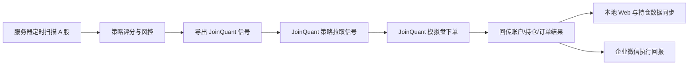

# A 股策略项目规划与状态

更新日期：2026-10-04

> 2026-10-04 JQData 自动增强与 GitHub 工程复核：`JQDataProvider` 已增加历史 `is_st` 和按日期证券主数据能力，`history_acquisition.py` 默认自动尝试补齐 ST 与日期股票池；JQData 每日查询配额由 `--max-universe-query-days` 默认 20 保护，超过配额时只降级该增强并记录警告，不伪造 strict 结果。真实账号小窗口增强成功（5 个交易日、100 条 ST/股票池记录）；247 个交易日窗口成功采集 4,940 条价格与 ST 记录，`universe.csv` 仅保留价格行的降级对齐、没有逐日历史股票池证明，价格核心回测仍通过。新增 `docs/github_quant_references.md`，记录 Qlib、RQAlpha、Backtrader 和 vn.py 的工程借鉴边界。

> 2026-10-04 多数据源增量：新增 `market_data_provider.py` 统一 Provider 协议和本地凭据加载、`data_source_registry.py` 有界数据集注册、JQData 本地 API 适配器、券商历史导出适配器和 `cross_source_compare.py`。AkShare、JQData 和未来券商历史数据均先落成独立 `dataset_id` 再进入同一 `HistoricalStore`；实时行情和真实下单仍保持未实现边界。JQData 账号认证成功，当前权限可用窗口为 2025-06-27 至 2026-07-03，已采集 20 只股票/4,940 条日线。与同窗口 AkShare 对照后，relative_v1 + liquidity_v1 均为负，JQData 净收益 -3.18%、AkShare -2.96%；两者均为 `proxy_only`，不具备 strict 或生产资格。

> 2026-10-04 本地策略改进增量：`historical_strategy.py` 增加 `relative_v1` 横截面相对强度、20日波动、流动性质量和市场宽度 regime；`historical_backtest.py` 增加 `liquidity_v1` 动态滑点、成交额参与率上限、最短持有期，并允许 Walk-forward 在 alpha/滑点 profile 上只用训练窗口选参。`history_acquisition.py` 增加当前 A 股代码发现能力，但仍明确标记为 proxy，不能替代历史点时股票池。新增 `paper_replay.py` 将同一候选生成器回放到有界本地模拟账户。2025 年代理数据初测的 `relative_v1 + liquidity_v1` 净收益为负且落后等权代理，因此该 profile 仍为候选实验，未替换基线，也不具备生产资格。

> 2026-10-03 本地策略候选增量：新增 `local_entry_policy.py`，将价格跳空、组合暴露、行业/相关性、成本覆盖和开放风险门抽为可供回测与未来券商准入复用的纯函数；`historical_backtest.py` 的候选参数增加趋势确认、追涨 ATR、信号连续确认、分数上限、组合风险和可选市场风险退出，开盘定仓不再读取当日收盘市值。`trend-confirmation-v4` 在 2018–2025 AkShare price_core 代理数据上净收益 +1.60%、最大回撤 4.69%、Profit Factor 1.112、换手 20.64 倍，但相对等权代理仍为 -12.35%，去掉最高三笔收益后净收益为负，且 strict、holdout、券商成交观察和压力测试仍未通过；状态仍为研究候选，不得推断生产可用。

> 2026-10-02 本地历史验证增量：新增 `history_acquisition.py`，提供有界 AkShare 日线代理采集；输出明确标记 `proxy_only=true`、`strict_eligible=false`，不补造历史 ST、停牌、股票池或完整涨跌停事实。`historical_backtest.py walk-forward` 已支持训练窗口选参、至少 3 个滚动验证窗口和最终 holdout，当前本机 `jq-strict-probe-202607` 只有 23 个交易日，3 折加 5 日 holdout 以 `INSUFFICIENT_WALK_FORWARD_DATES:18<36` 失败关闭。真实 strict 数据仍必须通过 JoinQuant 月包导出和 `strict_history_ingest.py` 导入，当前没有可审计的 6–12 个月样本外结果。

> 2026-08-11 聚宽运行隔离与污染清理检查点：用户确认 8 月 8–10 日均运行过回测，但生产证据显示只有 8 月 8 日 03:19:56–03:25:43 的旧在线模板写入生产接口，形成 211 个账户快照、217 次对账、1 条当日权益和 1 份当前券商快照；8 月 9–10 日无同类 API 写入，8 月 10 日 27 次真实扫描已核对并保留。服务器已部署 `97d251b`，聚宽端 `sim_trade` fail-closed、服务器头部/正文双验证和落盘同步复核均已生效；污染数据库行、241 条账户历史、482 条 API 事件、3539 条陈旧网页同步事件及两个活动快照文件已从活动数据移入 `/opt/stock-analysis-backups/quarantine/joinquant-backtest-20260808-20260810/`，manifest 状态 `completed`、目录/文件权限 700/600。清理前 verified backup 为 `trading-2026-08-11-614bea4fcd03.db`，`integrity_check=ok`。Linux 1069 项全量测试通过（2 项平台限定跳过），账本 schema 12 健康可写，三个核心服务与相关 timer active、`NRestarts=0`、warning 日志 0，API 缺运行身份返回 409、精确身份返回 200；`stock-analysis.env` SHA-256 前后均为 `5286a61bcdb7f632af3719fe17e629d53a088a954d1d4696e51ade247bfc5be1`，密钥和 Token 未修改。服务器和本地提交已完成，推送 `origin/main` 仍受当前外发审批阻断；聚宽网站在线模拟盘尚未更新到 `2026-08-11.1-runtime-isolation`，所以当前无活动账户快照，同步器会安全输出 `JOINQUANT_SYNC_SKIPPED no_accepted_snapshot`，不能把该状态误写成模拟盘已恢复观察。

> 2026-08-10 多路径因子与聚宽导出器发布检查点：B0-B7、聚宽原生回测、strict 历史导出、策略快照、一键脚本和开发手册已随提交 `f2c9441` 推送到 `origin/main`；三类输出继续由同一个确定性构建器生成，便携层保持 Python 3.6 兼容、逐时点反前视、真实 `prev_close` 回退、路径级容量/费用/退出和有界归因。Windows 全量发现共 1060 项，1057 项通过；其余 3 项仅因本机没有 Linux `bash`，无法启动 `run_ubuntu.sh ledger-check`，没有策略、导出器或数据契约测试失败。当前严格状态为 `implemented / regression-tested / committed / pushed / not deployed / not observed / not validated`。本轮未连接服务器、未部署或重启，未读取、打印、修改或轮换 SSH 私钥、JoinQuant Token、Webhook、`stock-analysis.env`、账户和正式数据库。任何后续服务器部署和重启必须按当次授权另行执行并重新验证外部状态。

> 2026-08-09 P1 最终代码检查点：服务器当前运行策略现可通过桌面“**一键生成聚宽策略快照**”冻结为 Python 3.6 兼容、去敏、确定性的六成员证据包，并直接生成 `聚宽原生回测策略.py` 与 `聚宽严格历史导出.py`。逐 5 分钟时点内核版本为 `2026-08-09.11`，按当时可见的股票池、分钟行情、前一交易日前完整日线、历史 ST/上市状态、行业和组合状态重建约 30 只候选，记录选中/拒绝原因并按下一决策时点成交；未来时点字段一律拒绝。第一次真实整月 strict 运行在旧导出器触发 `INVALID_NUMBER: prev_close`；导出器 `2026-08-09.9` 现优先使用聚宽 `pre_close`，只回看真实有效的更早收盘价，无法取得核心日线证据的股票日会有界审计后排除，不用当日或未来价格补造。服务器 `/opt/stock-analysis` 基线仍为 `90f3495`，修复后 Linux 全量测试 1035/1035、Windows 可运行测试 1037 项通过，另 3 项 Linux `bash` 边界测试在 Windows 因缺少命令产生预期错误；主服务于 19:12:10 CST 受控重启并保持 active，信号服务 active，错误日志为空，`stock-analysis.env` SHA-256 前后均为 `5286a61bcdb7f632af3719fe17e629d53a088a954d1d4696e51ade247bfc5be1`。最终权威快照 ID 为 `ca19580c155150df28e0b448cb6e3243c871be8a8bea2a4f5978bcc23ded6dd2`，包 SHA-256 为 `2efff24f1007b3201da4a9fc8e1728755457e0873c757b75dd23432c2531d97c`，本机真实一键下载和逐成员复核通过。当前增量为 `implemented / server deployed / first full-month failure reproduced and fixed / not committed / not pushed`；正式 `cache/backtest/history.db` 仍不存在，修复后的首个整月包尚未生成和导入，也未完成整月、6 个月或 1 年回测，所以长期结果仍为 `not observed / not validated`。

> 2026-08-06 最新发布检查点：Batch A/B 与 Batch C ML-7 Tasks 4–10 已合并并推送到 `origin/main`，服务器已部署提交 `5d2c4a2018ca95b9febd6751b4964fec507fe1bc`，正式交易库为 schema 12。服务器 Python 3.12.3 的既有 `.venv` 已安装 `scikit-learn==1.9.0` 与 `joblib==1.5.3`；Linux 全量测试 1003/1003、`ledger-check` 健康/可写、迁移后在线备份完整性、环境文件哈希不变、三个核心服务和通知 timer active 均已核验。`stock-notify-retry.timer` 已路由到 SQLite `notification_worker.py --once`，部署后 outbox 为 sent=3、pending/dead/gap=0。ML 仍为 `enabled=0 / max_level=0 / dataset_configured=no`，标签、训练和 ML/history 备份 timer 未启用；没有真实一年 strict 数据、可信/可批准模型、人工审批、活动模型或服务器 L0 观察证据。因此代码状态为 `implemented / committed / deployed`，运行效果仍为 `not observed / not validated`；JoinQuant 网站模板未在本次任务中修改。

本文档是当前项目规划的唯一主说明，合并已有能力、JoinQuant 接入方案、服务器部署流程，以及后续机器学习优化路线。其他早期设计文档只作为历史参考；如果口径冲突，以本文档为准。

## 当前有效从文档索引

日常工作只把下表视为当前有效从文档。新电脑或新对话先读 `AGENTS.md`、本文和 `docs/project_handoff.md`，然后仅按任务范围读取相关从文档；`docs/archive/` 只用于追溯历史，不参与当前状态、阶段或优先级判断。

| 从文档 | 权威范围 | 当前用途与读取条件 |
| --- | --- | --- |
| `docs/project_handoff.md` | 新电脑、新对话和外部状态恢复 | 时间点快照；接管任务必读，服务器状态仍需重新验证。 |
| `docs/2026-10-02_本地策略优先实施计划.md` | 本地策略、数据、回测、组合风控和模拟盘优先改造顺序 | 当前改造任务的执行计划；券商自动下单只保留接口边界，按阶段验收。 |
| `docs/2026-10-02_点时数据获取与样本外验证报告.md` | 点时历史数据获取、代理数据边界、样本外和 walk-forward 运行方式 | 当前数据采集和验证任务的唯一专项说明；涉及历史库补数、walk-forward 或数据源切换时读取。 |
| `docs/github_quant_references.md` | GitHub 开源量化项目的工程借鉴和许可证边界 | 修改数据层、特征层、回测撮合、风险或券商网关前参考；不直接复制未经验证的策略代码和参数。 |
| `docs/live_trading_execution_plan.md` | 模拟盘稳定性、完整历史回测、实盘级风控、交易适配和真实资金前门槛 | 涉及阶段推进、部署验收或实盘化时读取。 |
| `docs/codex_simulation_observation_plan.md` | Codex 定时只读审核、证据、报告和权限 | 涉及自动审查、服务器只读访问或阶段评估时读取。 |
| `docs/data_storage_policy.md` | 数据分类、增长、保留、轮转、备份恢复和敏感信息 | 任何新增或修改持久化数据时必读。 |
| `docs/strict_history_three_step_guide.md` | 聚宽导出、下载、拖入上传图标的三步图文操作 | 普通使用者准备或上传 P1 月包时先读。 |
| `docs/strategy_snapshot_one_click_guide.md` | 从服务器当前运行策略一键生成去敏聚宽快照 | 策略更新后或首次准备 strict 历史导出前先读。 |
| `docs/joinquant_strict_history_export_manual.md` | 聚宽 strict 月包契约、手工校验和故障排查 | 实现严格历史 provider 或自动流程报错时读取；普通上传不需要执行其中命令。 |
| `docs/joinquant_exporter_development_manual.md` | 聚宽快照、原生回测、strict 导出、便携因子和上传链路的开发维护契约 | 修改或诊断上述代码前必读；集中记录 Python 3.6、反前视、版本联动、历史故障和回归清单。 |
| `docs/joinquant_runtime_isolation_and_cleanup.md` | 在线模拟盘/回测运行身份隔离、污染识别、隔离清理和密钥不变部署契约 | 修改在线模板、信号 API、账户同步或处理回测污染前必读；记录 2026-08-08 至 10 日事故边界和恢复步骤。 |
| `docs/superpowers/specs/2026-08-10-multipath-factor-simulation-design.md` | 动量、第三浪、跌停衰竭三路径的 B0–B7 业务与安全契约 | 修改多路径候选、因子阈值、费用、容量、退出、strict 归因或研究准入前必读；当前已随 `f2c9441` 提交并推送，尚未部署、观察或验证。 |
| `docs/superpowers/plans/2026-08-10-multipath-factor-simulation.md` | B0–B7 文件级实施证据与发布边界 | 核验本轮实现范围或继续测试/发布时读取；外部状态不得由本地状态推断。 |
| `docs/superpowers/specs/2026-07-11-simulation-stability-ledger-design.md` | SQLite 账本、幂等、对账、安全和 20 日验证 | 涉及账本、订单/成交、对账或稳定性门槛时读取；Batch 1 与后续目标状态必须分开。 |
| `docs/superpowers/specs/2026-07-13-layered-exit-risk-management-design.md` | 当前买入、卖出、持仓周期、组合风险和安全降级规则 | 修改策略、交易、仓位、止盈止损或风险逻辑前必读。 |
| `docs/superpowers/plans/2026-07-13-layered-exit-risk-management.md` | 2026-07-13 分层退出历史 Batch A-G 实施与观察证据 | 追溯既有风险能力时读取；当前新增实施顺序以 2026-07-28 四批计划为准。 |
| `docs/superpowers/specs/2026-07-14-execution-contract-p0-fixes-design.md` | 版本化买入执行契约、退出意图续执行、JoinQuant 5只/80%边界和分类暴露 | 修改或核验这五项 P0 时必读；当前为 `implemented（已推送） / deployed（服务器与 JoinQuant 模板） / not observed / not validated`。 |
| `docs/superpowers/plans/2026-07-14-execution-contract-p0-fixes.md` | 五项 P0 的测试驱动实施与验收步骤 | Tasks 1–6 和部署已完成；后续用于真实交易日观察与验收。 |
| `docs/superpowers/specs/2026-07-14-sqlite-backup-recovery-design.md` | SQLite 自动备份、7/4/12 轮转、恢复演练、告警和状态门槛 | 实现、部署或审核交易账本备份恢复时读取；当前为 `implemented（已推送）`，服务器代码和一次人工备份/校验已由用户输出确认，timer 连续证据仍待核验。 |
| `docs/superpowers/plans/2026-07-14-sqlite-backup-recovery.md` | SQLite 自动备份与恢复演练实施任务和验证命令 | 修改或部署备份恢复能力时读取；Tasks 1–5 为 `implemented（已推送）`。 |
| `docs/superpowers/plans/2026-07-14-complete-trading-ledger-reconciliation.md` | schema 6 完整成交账本、自动对账和人工解锁实施证据 | 修改订单、成交、快照、权益、对账或交易控制时读取；当前为 `implemented（已推送）`。 |
| `docs/superpowers/specs/2026-07-14-notification-review-idempotency-design.md` | 企业微信执行回报幂等、D+1 全量复盘和统一服务器时间 | 修改成交通知、信号复盘或通知公共出口时读取；当前为 `implemented（已推送） / deployed / not observed / not validated`。 |
| `docs/superpowers/plans/2026-07-14-notification-review-idempotency.md` | 新成交事件通知、统一时间和 D+N 全量复盘实施证据 | 修改或观察上述能力时读取；当前为 `implemented（已推送） / deployed / not observed / not validated`。 |
| `docs/superpowers/specs/2026-07-14-point-in-time-historical-backtest-design.md` | strict/price_core 双轨逐日时点历史回测、反前视和撮合证据边界 | 修改完整历史回测、walk-forward、历史数据质量或 Batch G 回测门槛时读取；当前为 `implemented（已推送）`。 |
| `docs/superpowers/plans/2026-07-14-point-in-time-historical-backtest.md` | 独立历史库、候选生成、逐日撮合、指标、CLI和验证任务 | 实现或核验完整历史回测时读取；框架已进入 `origin/main`，真实严格数据运行尚未观察或验证。 |
| `docs/superpowers/specs/2026-07-14-semi-automatic-parameter-review-design.md` | 参数候选、准入、人工批准、版本和回滚治理 | 设计参数复核或机器学习与参数边界时读取；当前为 `planned`。 |
| `docs/superpowers/plans/2026-07-14-semi-automatic-parameter-review.md` | 半自动参数复核未来实施任务 | 数据与前置门槛满足后执行；当前为 `planned`。 |
| `docs/superpowers/specs/2026-07-15-trained-shadow-model-design.md` | ML-7 五分钟候选样本、训练型影子模型、walk-forward、模型治理和逐层放权 | 设计或实现训练模型、模型存储、影子观察或模型权限时读取；Tasks 4–10 已实现、提交并随 `5d2c4a2` 部署，Task 11 已完成 Linux 1003/1003、文档真值和安全复审；Task 12 仅完成服务器代码/依赖部署，L0 启用和交易日观察未运行。 |
| `docs/superpowers/plans/2026-07-15-trained-shadow-model.md` | ML-7 训练型影子模型的测试驱动实施、验证、部署与观察顺序 | 执行训练模型代码或核验实施范围时读取；当前代码已部署但 ML 默认关闭，尚无 strict 数据、可批准模型、L0 观察或 validated 证据。 |
| `docs/superpowers/specs/2026-07-15-execution-timing-reconciliation-recovery-design.md` | 调度边界、信号生命周期、退出执行状态、告警转换和安全自动恢复 | 修改扫描调度、信号时效、自动对账或买入恢复时必读；当前为 `implemented（已推送） / deployed（服务器；JoinQuant 网站由用户确认已手动更新） / not observed / not validated`。 |
| `docs/superpowers/plans/2026-07-15-execution-timing-reconciliation-recovery.md` | schema 7 与执行状态修复的测试驱动实施及部署证据 | Tasks 1–10、Linux 324/324 测试、服务器 schema 7 迁移和服务重启已完成；后续用于真实交易日观察与验收。 |
| `docs/superpowers/specs/2026-07-16-unified-effective-stop-trading-dashboard-design.md` | 成交后初始止损校验、四类止损唯一事实源、交易运行面板、网页安全和可观测性增强 | 修改止损、持仓网页或止损迁移时必读；基础能力和可观测性增强均为 `implemented（已推送） / deployed（服务器） / not observed / not validated`；JoinQuant 网站仍以用户此前确认的模板状态为准。 |
| `docs/superpowers/plans/2026-07-16-unified-effective-stop-trading-dashboard.md` | schema 8、统一止损、网页重构、可观测性增强、测试与部署顺序 | Tasks 1–17 的实现、推送和服务器部署已完成；交易日观察与验收尚未完成。 |
| `docs/superpowers/specs/2026-07-18-gap-reentry-confirmation-design.md` | 跳空越过计划价、涨停开板二次确认、最小一手例外和新信号隔离 | 修改跳空补充入场、炸板确认或最小一手逻辑时必读；当前为 `implemented（已推送） / deployed（服务器与网站模板，功能已开启） / not observed / not validated`；机会账本仍为空。 |
| `docs/superpowers/plans/2026-07-18-gap-reentry-confirmation.md` | 跳空二次确认的状态机、schema 9、执行契约、最小一手、JoinQuant复核和验收步骤 | Tasks 1–7 已实现、复查、推送并部署服务器；开关已开启且模板已一致，交易日机会样本和验收尚未出现。 |
| `docs/superpowers/specs/2026-07-23-pandas-holding-series-health-fix-design.md` | 持仓候选触发扫描失败的根因、最小修复和验证边界 | 当前为 `implemented（已推送） / deployed（服务器） / observed / not validated`；部署或核验该扫描健康事故时读取。 |
| `docs/superpowers/plans/2026-07-23-pandas-holding-series-health-fix.md` | 持仓 Series 布尔歧义的测试驱动修复与发布检查 | 代码、测试、推送、Linux 验证、服务器部署和首轮真实扫描观察已完成；连续稳定性验证尚未完成。 |
| `docs/superpowers/specs/2026-07-26-runtime-evidence-integrity-repair-design.md` | 扫描运行账本、信号结构化字段、费用/盈亏可信度、交易时段健康口径、通知失败终态和登录异常 | 当前为 `implemented（已推送） / deployed（服务器） / not observed / not validated`；未改变任何交易策略或控制语义。 |
| `docs/superpowers/plans/2026-07-26-runtime-evidence-integrity-repair.md` | 上述修复的测试驱动实施、验证、文档、发布与隔离恢复演练步骤 | Tasks 1–7、Linux 全量、合并、推送、schema 10 部署和恢复演练已完成；真实交易日观察与验证尚未完成。 |
| `docs/superpowers/specs/2026-07-28-small-capital-live-readiness-integration-design.md` | 小资金真钱前置、通知、五头表格模型和 QMT 节点的整合边界 | 当前总设计；Batch A/B 与 Batch C Tasks 4–10 已随 `5d2c4a2` 部署，Task 11 已完成；真实交易日观察、ML L0 和 Batch D/QMT 仍未完成。 |
| `docs/superpowers/plans/2026-07-28-small-capital-live-risk-execution.md` | Batch A 精确数量、统一准入、schema 11 与盈利保护的唯一实施计划 | Tasks 1–8 已实现、提交并随 schema 12 部署；Linux 1003/1003 已通过，JoinQuant 模板与交易日观察仍待核验。 |
| `docs/superpowers/plans/2026-07-28-transactional-notification-outbox.md` | Batch B SQLite 事务通知 outbox 与规则影子评分退役 | Tasks 1–7 已实现、提交并部署为 schema 12；worker 路由和一次真实 outbox 消费已核验，连续交易日观察与验证仍未完成。 |
| `docs/superpowers/plans/2026-07-28-five-head-ml-training-runtime.md` | Batch C 五头表格模型训练、治理和 L0 推理 | Tasks 4–10 为 `implemented / committed / deployed`，Task 11 已完成；Task 12 仅完成服务器代码与依赖部署，ML 仍关闭且未观察/验证。 |
| `docs/superpowers/plans/2026-07-28-broker-adapter-qmt-node.md` | Batch D BrokerAdapter 与默认禁单的 Windows QMT 节点 | `planned / not implemented / not deployed / not observed / not validated`；vn.py 仅保留为后续第二适配器。 |

归档索引见 `docs/archive/README.md`。归档文档不得覆盖本表中的活跃文档，也不作为开始任务的默认必读资料。

## 2026-08-06 Batch A/B/C 发布检查点

Batch A Tasks 1–8、Batch B Tasks 1–7 和 Batch C ML-7 Tasks 4–10 已随 `5d2c4a2` 合并、推送和部署。新增能力包括 schema 11/12 的账户作用域与 broker 当前快照、不可变 candidate/result/intent、原子容量预留、统一 `pre_trade_check`、普通买单精确 `target_qty`、一手/奇数手盈利保护、事务通知 outbox/worker、规则影子评分退役，以及有界离线五头模型训练/治理/L0 旁路代码。当前实现只证明单一 JoinQuant 账户；`position_cycles`/`exit_intents` 仍按股票全局唯一，JoinQuant 与 QMT 双账户隔离必须等待 Batch D/schema 13。

Linux 全量测试已在服务器通过 1003/1003，正式库 schema 12、备份、通知 worker 路由、环境哈希和核心服务均已核验。当前代码状态严格为 `implemented / committed / deployed / not observed / not validated`；本次没有修改 `stock-analysis.env`、Token、Webhook、私钥或 JoinQuant 网站模板。新买卖语义仍须经过代表性交易日观察，不能因静态部署成功写成 validated。

## 2026-08-05/06 Batch B Tasks 1–7 部署检查点

通知专项 Tasks 1–7 已部署为 schema 12，包含稳定 `NotificationEvent`、来源事实同事务 outbox/gap、逻辑计划/TTL、UTC 租约 worker、有限重试、粘性 ambiguity 证据、容量控制、CRITICAL 180 交易分钟复报、规则影子退役、systemd 路由、备份/外键恢复校验、详细 `ledger-check` 和带事件键校验的人工解除 CLI。部署后 `stock-notify-retry.timer` 已运行 SQLite worker，3 条待处理事件转为 sent，pending/dead/gap 均为 0；这只构成一次部署后功能证据，不构成连续交易日 observed/validated。

## 2026-08-06 Batch C ML-7 服务器代码部署检查点

ML-7 Tasks 4–10 已实现、提交并部署；Task 11 的文档真值、全量回归和安全复审已完成。Task 12 当前只完成代码、依赖和服务器运行入口部署，ML 明确保持 `enabled=0 / max_level=0 / dataset_configured=no`，标签/训练/ML 与历史库备份 timer 未启用。当前没有真实一年/365 天 strict 数据证据、可信或可批准的训练模型、人工审批、活动模型或服务器 L0 证据，因此仍为 `deployed / not observed / not validated`。

## 2026-07-26 两周运行审核与证据完整性修复

服务器只读审核区间为 2026-07-12 至 2026-07-26。审核开始时本地、`origin/main` 和服务器均为
`979d327e383212d8da0d8387c1eb9579d40536c3`，三个核心服务 active，实际 JoinQuant
模板与期望版本均为 `2026-07-18.1-gap-reentry`，`GAP_REENTRY_ENABLE=1`。这取代本文
此前“功能关闭、网站模板未确认”的旧状态，但跳空二次入场机会账本仍为空，因此该路径
仍是 `deployed / not observed / not validated`。

区间内 journal 记录 306 次成功扫描、150 次失败；其中 146 次为 2026-07-23 已修复的
Pandas 持仓 Series 布尔歧义，修复后只有 2026-07-24 一个完整交易日证据。正式账本中
7 笔订单均已成交，2026-07-20 至 2026-07-24 的对账全部 matched；但扫描失败没有进入
`strategy_runs`，信号结构化列未填充，成交费用和日已实现盈亏无法区分真实零与来源
缺失。健康报告还把盘后/周末的新鲜度陈旧计入 critical，通知队列有 6 条
`errcode=40058` 永久失败被反复重试，网页登录存在非 ASCII 错误令牌 500 路径。

专项修复设计见
`docs/superpowers/specs/2026-07-26-runtime-evidence-integrity-repair-design.md`。当前严格为
`implemented（已推送） / deployed（服务器） / not observed / not validated`。本轮只修复
运行证据、数据可信度、健康口径、通知终态和登录健壮性，不改变买卖、止盈止损、仓位、
对账控制或 JoinQuant 执行语义。稳定观察时钟应从修复部署后的首个完整有效交易日重新累计。

该修复已把正式交易库升级为 schema 10：只增加成交费用、日费用和日已实现盈亏
三个来源状态列，历史值标记 `unknown`，明确来源值标记 `reported`；没有重建表或猜测收益。
扫描生命周期、信号结构化列、四维健康状态、有界通知 dead/pending 队列和 Unicode 登录
修复均已通过目标专项 142 项。Windows 全量发现457项，其中454项完成通过；服务器 Linux
全量457/457和目标模块编译通过。服务器于2026-07-26快进到 `68d7283`，部署前schema 9在线
备份完整性为 `ok`，正式库幂等迁移到schema 10并通过健康/可写检查，迁移后在线备份与隔离恢复
演练完整性均为 `ok` 且表计数一致；配置哈希未变化，三个核心服务active，重启后ERROR日志计数为0。
这些是部署证据，不是交易日观察或验证证据。

## 2026-07-23 持仓候选扫描健康事故

服务器只读诊断确认，2026-07-23 10:32 后多轮盘中扫描在持仓股票进入主候选或扩大
观察池时失败，`signals.json` 因此不能继续刷新。完整 traceback 定位到
`build_risk_decision` 对 `pd.Series` 持仓使用 `if holding`，触发 Pandas 布尔歧义；
服务、SQLite、账户快照、模板和 API 本身并非本次根因。

本地修复把共享存在性判断改为 `holding is not None`，没有调整买卖、止盈止损、评分、
仓位、通知或数据存储规则。回归测试完成 RED/GREEN 验证，风险引擎专项 7/7、目标模块
编译和不依赖 Linux Bash 的 Windows 测试 436 项通过。提交
`2cb90485290e75883379dada2b934637d87ffa37` 已推送并部署；服务器 GitHub 拉取失败后，
使用两端 `git bundle verify` 通过的增量 bundle 快进。部署前正式 SQLite 备份
`integrity_check=ok`；Linux 全量 441/441、目标模块编译、schema 9 `ledger-check`
健康/可写、环境文件哈希不变，三个服务重启后 active 且无 warning。

13:00 后首轮真实扫描成功越过主候选和扩大观察池处理，南山铝业按“持仓风控”路径
处理，13:05:58 写出 `scan_20260723_130558.*` 并刷新 `signals.json`；13:06:10 增量
对账为 `matched / INFO / 0差异`，交易控制为 `buy_enabled=1 / kill_switch=0`。当前严格
状态为 `implemented（已推送） / deployed（服务器） / observed / not validated`；仍需
连续代表性交易时段无同类扫描中断，才能标记 `validated`。

## 2026-07-16 统一有效止损与交易运行面板

本地代码已经把网页和卖出引擎收敛到同一个有效止损解析器：`initial_stop_price` 是按真实持仓成本和板块最大亏损边界只收紧校验后的冻结止损；`manual_stop_price` 默认空，只允许用户明确上调或清除并写 `control_events`；`trailing_stop_price` 只在首段止盈后派生；`effective_stop_price=max(initial, manual, activated trailing)` 是唯一卖出阈值。JoinQuant 快照不再按成本价自动生成 3.5% 网页止损，活动旧周期只允许上调修复且不把旧网页显示值伪装成人工指令。

统一止损增量当时把 SQLite 升至 schema version 8，只给 `position_cycles` 增加可空 `manual_stop_price`，不持久化重复有效止损；2026-07-19 的跳空增量随后把目标升至 schema 9，之后又由 schema 10 检查点取代。手机网页已改为认证后的交易运行面板，展示运行状态、活动异常、持仓四类止损与执行轨迹；手工区只维护人工止损，不提供直接买卖。截图上传、OCR、确认和文件访问路由及 Tesseract 依赖已删除，历史上传文件保留。JoinQuant API/模板改为优先使用 Authorization bearer，服务器暂时保留 query token 兼容并对有效 query 凭据做访问日志脱敏。

2026-07-19 已确认在原交易运行面板内增加三分区可观测性：今日运行补充各数据源时效、
版本确认、异常影响和待执行原因；交易与持仓补充风险倍数、入场依据和完整交易链路；
研究与验证严格区分 planned / implemented / deployed / observed / validated。该增强
复用现有 SQLite 有界查询，不新增持久化或直接交易、自动解锁、参数修改和模型启用
入口。代码与测试最初在隔离分支实现；这是部署前历史状态，已被下段部署检查点取代。

实现提交 `8db92bf6448466827a50560ae2fb8c7fde142c72` 已推送到 `origin/main` 并部署服务器。服务器到 GitHub 两次超时后，使用本地和服务器均通过 `git bundle verify` 的 `0e246c2 → 8db92bf` 增量 bundle 做 fast-forward，并把服务器 `origin/main` 跟踪引用同步到同一提交。部署前 schema 7 正式账本在线备份成功且 `integrity_check=ok`；Linux 全量 414/414、目标模块编译、schema 8 `ledger-check` 健康/可写、环境文件哈希不变、三个核心服务 active。部署后手工运行一次持仓同步成功刷新2个 JoinQuant 持仓；网页未认证请求返回302登录跳转，信号 API 未认证请求返回403，重启后五分钟三个服务无 ERROR 日志。用户随后确认已在 JoinQuant 网站手工更新模板 `2026-07-16.1-unified-effective-stop`，但尚无新交易日快照回传证明网站实际运行版本。

截至该次检查点的严格状态为 `implemented（已推送） / deployed（服务器；JoinQuant 网站为用户确认） / not observed / not validated`。Windows 可运行全量409项、专项85/85和服务器 Linux全量414/414均通过；部署和非交易时段同步不能替代新模板交易日回传、止损触发/受阻/成交闭环与连续观察验收。

## 2026-07-18 跳空越价后二次确认入场规划

已确认新增一条独立的补充买入路径：股票必须在当前五分钟批次重新入选，旧计划只提供原入场、原止损和冻结风险单位；价格上限为 `原入场 + 0.5R`。封死涨停不排队，开板后至少经过两次独立有效扫描确认，回封重置，一天最多两次开板观察；14:45 后不启动，14:50 后不新增仓位。确认后生成全新信号和执行契约，禁止恢复旧信号。

正常风险仓位不足 100 股时只进入最小一手例外检查；100 股必须同时满足现金、单笔风险、单票/行业/题材/总仓位、持仓数量和开放风险边界，否则放弃。`RISK_OFF`、人工停止买入、kill switch、健康/对账门、行情陈旧、同股持仓或未完成订单等继续优先。计划增加事件级有界机会账本支持成交与拒绝机会的反事实复盘，不新增逐扫描无限文件。

专项设计见 `docs/superpowers/specs/2026-07-18-gap-reentry-confirmation-design.md`。提交 `5ad0ad539ef66aa7cf1073ad7142fde116d74ea5` 已实现并部署服务器：纯状态机、schema 9 事件级机会账本、当前候选重新验证、两轮开板确认、最小一手风险复核、全新执行契约和 JoinQuant 最终复核均已进入运行代码。2026-07-19 部署前在线备份完整性为 `ok`，服务器虚拟环境 Linux 全量440/440、Python编译、schema 9健康/可写、环境文件哈希不变、三个服务active且重启后无 warning 及以上日志。当前严格为 `implemented（已推送） / deployed（服务器与网站模板，功能已开启） / not observed / not validated`；2026-07-26 只读核验确认 `GAP_REENTRY_ENABLE=1`，实际与期望 JoinQuant 网站模板均为 `2026-07-18.1-gap-reentry`，但机会账本仍为空，不能据此标记 observed。

## 2026-07-15 schema 7 部署检查点

2026-07-15 成交对账日期范围修复当前为 `implemented（已推送） / deployed（服务器） / not observed / not validated`：完整对账只把当前 `account_snapshots.trade_date` 的 SQLite 成交与 JoinQuant 当日 `get_trades()` 比较，历史成交继续保留但不再被误报为平台缺失；同日缺失仍为 `FILL_MISSING_PLATFORM / WARNING`，平台成交未入本地账本仍为 `FILL_MISSING_LOCAL / ERROR`。代码提交 `cd83f26` 已部署；部署前 SQLite 备份完整性为 `ok`，Linux全量326/326、Python编译、schema 7健康/可写、配置未变、三个服务active和重启后ERROR日志为空均已核验。仍需新交易日快照才能标记 observed，连续代表性证据和恢复闭环完成前不得标记 validated。

2026-07-15 的 schema 7 部署检查点实现 00:00–09:14 `closed` 阶段、09:15 单次盘前运行和阶段边界对齐休眠；信号增加 `created_at`、`validated_at`、`published_at`，JoinQuant 模板期望版本升级为 `2026-07-15.1-execution-state-recovery` 并可自愈旧进程缺失的运行全局变量。退出对账按有效交易分钟区分送达、陈旧、提交、部分成交、T+1/停牌/跌停和目标完成；执行问题按对象保存当前状态，企业微信按状态变化、恢复和受限 ERROR 提醒发送。只有 `ERROR` 对账自己实际关闭的 `buy_enabled` 才能在两个不同新鲜快照连续一致、无未决 ERROR/CRITICAL、无 `submit_unknown`、模板健康且 `kill_switch=0` 时通过 CAS 自动恢复；`CRITICAL` 不建立或保留自动恢复所有权，必须人工检查并恢复。任何人工买入或 kill-switch 操作、账户风控和 `RISK_OFF` 都优先且永不由该机制自动解除。

2026-07-15 复审修正已补齐：无 `order_id` 的 T+1/停牌/跌停/陈旧证据进入退出分类；提交和部分成交阶段计时不被重复快照重置；同对象按最高严重度保存；普通已解决问题可独立恢复而不可变成交/账本 CRITICAL 保持粘性；告警去重包含严重度，成功通知时间写回 SQLite，并支持每30分钟一次的持续 ERROR 提醒。人工 `resume-buy` 在既有资格检查和非空原因下可确认粘性 CRITICAL 已人工处理，但不会同时关闭 `kill_switch`。

实现提交 `e2ce5b50590edc28cb748bee1fa985f43c9a0366` 已进入 `origin/main` 并部署到服务器 `/opt/stock-analysis`。部署前 schema 6 SQLite 备份完整性为 `ok`；服务器因无法连接 GitHub 443，使用经 `git bundle verify` 验证的增量 bundle 快进到目标提交。Python 编译、隔离测试账本下 Linux 全量测试 324/324 和正式账本 `ledger-check` 均通过，正式 SQLite 已幂等迁移到 schema 7，`stock-analysis.env` 部署前后哈希一致，三个核心服务均为 active，重启后五分钟 ERROR 日志计数为0，服务器工作树与 `origin/main` 一致且干净。

该增量当前严格为 `implemented（已推送） / deployed（服务器） / not observed / not validated`。用户报告已在 JoinQuant 网站手动更新模板 `2026-07-15.1-execution-state-recovery`，但更新后尚无新账户快照回传，因此网站侧只记录为 `deployed（用户确认） / not observed / not validated`，仍需下一个有效交易日核对模板版本回传和真实执行。

部署后 `buy_enabled` 仍为 `0`、`kill_switch=0`。2026-07-15 盘后人工 `resume-buy` 因 `ACCOUNT_SNAPSHOT_STALE` 被安全门拒绝，未绕过门槛改库。已创建一次性 timer：2026-07-16 09:32、09:35 两次完整对账，09:37 仅在两份不同新鲜快照均一致、无未知提交且 CAS 状态未变化时恢复买入；在成功证据出现前仍必须报告“买入受限、恢复已排程”。

稳定性账本 Batch 1 当前状态为“代码已实现并部署服务器、待部署后首个有效交易日双写观察”；2026-07-12 只读核验确认服务器、本地代码当时均为 `54eaaf423f690dda84776304c4ec87846aa8cf66`，SQLite schema version 为 1 且空信号一致。此历史检查点不能替代当前服务器复核。

## 2026-07-14 Git 实现基线

提交 `9f4c12d` 已进入 `origin/main`，包含下列 `implemented（已推送）` 历史基线：全 JoinQuant 持仓硬止损覆盖、板块/ATR 初始止损、账户风险定仓、旧版 +2R 首段止盈、首段止盈后的移动止盈、短线3个/中线10个交易日时间止损，以及 `CAUTION` 减半风险仓位和 `RISK_OFF` 禁止新买入。卖出动作使用稳定持仓周期 ID，且优先覆盖同股买入。该提交已包含在服务器部署历史中，状态为 `deployed / not observed / not validated`；2026-08-06 部署的 Batch A 已用离散 100/300/500 股语义取代“统一卖一半”，新语义仍待真实交易日观察。

SQLite schema 6 是完整账本历史基线：除 schema 5 的持仓周期、委托事件、退出意图和冷却外，新增正式订单、不可变逐笔成交、账户摘要、压缩持仓检查点、日权益、对账批次/差异项和控制审计。回调先事务入账和自动对账，成功后才发布兼容 JSON；`ERROR` 停止新买入，`CRITICAL` 追加 `KILL_SWITCH`。该基线始于 `9f4c12d`，曾包含在 `e2ce5b5` / schema 7 检查点中，之后继续被 schema 10 扩展；状态为 `implemented（已推送） / deployed / not observed / not validated`。

JoinQuant 信号 JSON 继续使用兼容的 schema version 1，并增加可选 `target_qty`、回传 `get_trades()` 逐笔成交。`52b3653` / schema 6、`e2ce5b5` / schema 7 和 `68d7283` / schema 10 都是历史部署检查点；它们已被本文顶部记录的 `5d2c4a2` / schema 12 检查点取代。旧服务器 `aa9acffaf62239e39c076408d83d113dce22b029`、SQLite schema version 1 和模板 `2026-07-14.1-ledger-v6` 仅用于追溯。当前代码状态仍是 `deployed / not observed / not validated`；网站模板与实时交易行为须用后续交易日证据核验。

历史外部检查点（来自用户粘贴的服务器命令输出）：2026-07-14 20:06，服务器 `/opt/stock-analysis` 为 `131118213f22bbdaecd5cd8ab89a87db9aaf7f85`，`main...origin/main` 且工作区干净；备份 `PRAGMA integrity_check=ok`、SQLite schema version 6、`ledger-check` 健康且可写，`stock-analysis.env` 哈希校验未变化，扫描、持仓 Web、JoinQuant 信号三个服务均为 `active`。该检查点已被后续 `52b3653` 部署证据取代，仅用于追溯部署前基线。

2026-07-13 用户确认调整实施策略：执行安全、旧持仓迁移、真实组合买入风控、买入可交易性、市场状态滞后和冷却机制一次补齐。上述代码和自动化测试现已在 `origin/main` 中 `implemented（已推送）`，包括行业25%、题材20%、无分类单票10%、连续亏损交易日冻结、真实成交换手/日内盈亏/账户回撤回传、未完成买单风险占用、评分优先分配、JoinQuant下单前复核，以及买卖两侧陈旧行情和异常价保护；各模块有独立环境开关。服务器代码和 JoinQuant 模板已随本次 `52b3653` 部署确认，故为 `deployed / not observed / not validated`。唯一详细计划为 `docs/superpowers/plans/2026-07-13-layered-exit-risk-management.md`。

2026-07-14 五项执行正确性 P0 已随 `52b3653` 进入 `origin/main` 并部署：风险拒绝直接阻止买单；最终买入价、止损、+2R止盈和仓位由版本化单一执行契约生成；活动退出意图在达到目标仓位前持续重发且高优先级不得被降级；服务器与 JoinQuant 双层强制 5 只持仓和 80% 总仓位并分别应用买卖开关；已有持仓和未完成买单从 SQLite 信号账本恢复行业/主题，无分类仓位共享 10% 聚合上限。服务器部署前 SQLite 备份完整性通过，部署后专项测试 123/123、Python 编译和 `ledger-check` 通过，环境文件校验未变，三个核心服务 active；JoinQuant “AI” 策略已持久化模板版本 `2026-07-14.2-p0-execution-contract` 并保留原 URL、token 和运行配置。状态严格为 `implemented（已推送） / deployed（服务器与 JoinQuant 模板） / not observed / not validated`，仍不得据部署证据推断真实交易日行为。
阶段门槛分为两层：阶段 1 基础系统稳定性按连续 10 个有效交易日验收；专项设计中的 20 个有效交易日用于完整账本加固与策略验证。达到 10 日门槛不等于完成 20 日专项验证，两者均不得以代码实现或非交易日静态检查替代。

Batch G 参数复核采用“自动分析、人工批准、显式发布、版本化回滚”，专项设计和实施计划分别见 `docs/superpowers/specs/2026-07-14-semi-automatic-parameter-review-design.md` 与 `docs/superpowers/plans/2026-07-14-semi-automatic-parameter-review.md`。当前已有样本、部分标签、策略对照、信号级回测、逐日历史回测框架和 `parameter_version` 基础；候选登记、评价准入、人工决定、激活和回滚均为 `planned / not implemented / not deployed / not observed / not validated`。20 个有效交易日只允许开始数据复核，候选进入可批准列表还需要可用 strict 历史 walk-forward 证据加 20 个有效模拟盘交易日；缺少该证据时替代门槛为至少 60 个有效模拟盘交易日。任何自动任务和 Codex 只读审核员都无权批准或改变活动参数。

Codex 仍只允许只读观察、阶段评估和优化建议；数据持久化仍必须同时定义增长、保留、轮转、备份恢复和敏感信息处理。详细约束按上表读取对应从文档。

## 状态说明

- 已实现：代码或脚本已经落地，并通过现有测试或语法检查。
- 部分实现：核心能力已经有，但还缺少线上验证、运维加固或长期数据积累。
- 待实现：已明确方向，但还没有写入代码。
- 已废弃：代码可能仍为兼容或测试保留，但不再作为当前方案继续演进。
- 暂不启用：代码可能仍保留，但默认关闭，不作为当前主流程。

## 当前主流程

当前推荐流程是：服务器本地程序负责选股、打分、生成目标仓位和发送信号；JoinQuant 模拟盘负责实际模拟下单；JoinQuant 再把账户、持仓、订单执行结果回传到服务器；企业微信分别推送信号计划和执行回报。

```mermaid
flowchart LR
    A["服务器定时扫描 A 股"] --> B["策略评分与风控"]
    B --> C["导出 JoinQuant 信号"]
    C --> D["JoinQuant 策略拉取信号"]
    D --> E["JoinQuant 模拟盘下单"]
    E --> F["回传账户/持仓/订单结果"]
    F --> G["本地 Web 与持仓数据同步"]
    F --> H["企业微信执行回报"]
```

## 已完成能力

| 模块 | 状态 | 说明 |
| --- | --- | --- |
| A 股数据扫描与策略评分 | 已实现 | 现有策略会生成候选、分数、风险参数和目标仓位。 |
| 企业微信基础推送 | 已实现 | 支持策略报告、JoinQuant 信号计划、JoinQuant 执行回报；统一通知出口会在实际发送时增加服务器时间，失败重试使用新的实际发送时间。 |
| JoinQuant 信号导出 | 已实现 | 本地策略会导出 JoinQuant 可读取的买卖信号。 |
| JoinQuant 信号服务 | 已实现 | 提供信号拉取接口和账户快照回调接口。 |
| JoinQuant 策略模板 | 已实现 | JoinQuant 平台运行 `joinquant_strategy.py`，默认使用模拟盘真实下单模式，不是 dry-run。 |
| JoinQuant 执行回报 | 已实现 | 执行回报只由 SQLite 首次入账的新 fill 或无 trades 旧快照的累计成交增量触发；周期快照不会重复推送历史成交，零成交、失败和跳过不推送。 |
| JoinQuant 持仓同步 | 已实现 | 本地持仓展示读取 JoinQuant 回传结果，作为模拟盘主数据来源。 |
| 全持仓硬止损信号 | 已部署基线 | 每轮使用全市场实时价检查全部 JoinQuant 同步持仓；持仓即使未进入候选池，跌破既有止损价也会生成卖出信号。服务器已有部署证据，真实交易日代表性卖出仍待观察和验证。 |
| JoinQuant 健康检查与异常报警 | 已实现 | `joinquant_health.py` 会检查信号文件、账户快照、API 拉取/回传次数、失败原因、持仓一致性、JoinQuant 网站模板版本和稳定性评分，生成 `output/joinquant_health_YYYYMMDD.md`；非交易时段的信号/快照过期只记录报告，不刷微信报警。 |
| 企业微信失败重试 | schema 12 SQLite outbox 已部署 | `stock-notify-retry.timer` 已路由到 `notification_worker.py --once`；旧 JSON 只允许显式一次性审计。部署后一次消费结果为 sent=3、pending/dead/gap=0，连续交易日行为仍待观察。 |
| 节假日推送静默 | 已实现 | 非 A 股交易日默认不推普通扫描、买点提醒和 JoinQuant 空计划；可用 `NOTIFY_NON_TRADING_DAY=1` 临时打开联调。 |
| 盘后信号追踪复盘 | 已实现 | 对成功推送的买点按 D+0/D+1/D+3/D+5/D+10 交易日批次完整复盘；使用全量行情、固定分片，掉出候选池或行情缺失都不丢样本，风险提醒不混入买点统计。 |
| 本地信号级回测 | 已实现第一版 | `backtest_engine.py` 可读取 `cache/ml/signal_samples.jsonl` 或 `cache/joinquant/signals.json`，模拟信号买卖、手续费、印花税、T+1、止盈止损和仓位限制，输出 `output/backtest_report.md` 与 `output/backtest_trades.csv`。 |
| ML 样本采集与基础复盘 | 代码已部署、运行关闭 | 独立 ML SQLite、五分钟候选、标签、训练、治理和报告代码已部署；服务器 ML 为 enabled=0、max_level=0、dataset_configured=no，未形成真实 strict 训练或 L0 观察。 |
| Linux 一键部署脚本 | 已实现 | 当前统一使用 `run_ubuntu.sh`，旧的拆分脚本已删除。 |
| 本地模拟盘 | 已废弃 | 代码仍为兼容和历史测试保留，但默认关闭，不再作为当前模拟交易方案；主模拟盘只认 JoinQuant。 |
| 本地模拟盘交易时间限制 | 已废弃 | 该限制只服务旧本地模拟盘，当前不会参与主流程。 |
| 单元测试 | 已实现 | 覆盖 JoinQuant 信号服务、策略模板、同步逻辑等关键路径；本地模拟盘相关测试仅保留历史兼容性。 |

## JoinQuant 接入路线

| 阶段 | 状态 | 目标 |
| --- | --- | --- |
| 1. 信号契约 | 已实现 | 本地统一生成 `buy`、`sell`、目标仓位、止盈止损等字段。 |
| 2. 本地 API 服务 | 已实现 | JoinQuant 通过 token 拉取信号，并把账户快照 POST 回本地。 |
| 3. JoinQuant 模拟下单 | 已实现 | JoinQuant 策略根据本地信号在模拟盘执行下单。 |
| 4. 微信区分推送 | 已实现 | 当前主推 JoinQuant 模拟盘和执行回报；本地模拟盘标记只为废弃功能保留，默认不会推送。 |
| 5. 手机微信展示优化 | 已实现 | 执行结果按短段落、状态、原因、数量、价格展示，适配手机阅读。 |
| 6. 服务器完整部署 | 部分实现 | 核心扫描、JoinQuant 信号、持仓 Web 服务及现有定时器已部署；公网 HTTPS、反向代理、HMAC、防重放等生产安全加固仍未确认或待实现。 |
| 7. 线上稳定性观察 | 观察中 | 旧版 JoinQuant 拉取与快照链路已有真实交易日证据；2026-08-06 部署的 schema 12 新语义尚未形成足够连续有效交易日，阶段 1 尚未 validated。 |
| 8. 实盘前检查清单 | 部分实现 | readiness/健康报告、统一强制准入、精确数量和 schema 12 已部署；JoinQuant 网站模板仍需核验，BrokerAdapter/QMT 仍为 planned。 |

## JoinQuant 可执行信号规则

下列规则描述 2026-08-06 已部署的 schema 12 服务器代码语义：在不改变 SELL 与旧事件兼容的前提下，普通 BUY 必须由新鲜 broker/quote 证据通过统一强制准入，同一事务形成完整不可变 READY 意图和容量预留，并只按签名 `target_qty` 精确执行，不再使用金额回退。JoinQuant 网站模板未在本次部署中修改，端到端精确数量执行仍需模板核验和真实成交观察。

- 买入信号只在 A 股交易日交易时间内导出给 JoinQuant 执行，非交易时间只作为观察和微信提醒，不进入模拟盘下单。
- 当前可执行交易时间按连续竞价口径处理：`09:30-11:30`、`13:00-15:00`。`09:15-09:29` 属于盘前/集合竞价观察，不再标记为盘中，也不会导出买入下单。
- 买入信号要求当前价已经达到或高于建议入场价，且涨幅低于 9.8%，避免未到确认位或接近涨停时追入。
- 如果止盈价不高于建议入场价，微信单股提醒和盘中汇总都会显示为“无有效空间”，且不会导出 JoinQuant 买入信号。
- 卖出信号必须先确认 JoinQuant 同步持仓里已有该股票；未持仓股票即使出现止损、止盈、超时等卖出类风控标记，也不会导出卖出计划。
- 硬止损检查覆盖全部 JoinQuant 同步持仓，不要求持仓股票先进入当轮候选池；优先使用当轮全市场实时价，缺失时回退到同步持仓现价，并只沿用既有持仓止损价。
- 新卖出决策由服务器每轮风控判断；一旦形成活动退出意图，在 JoinQuant 持仓达到目标数量前，服务器会用稳定信号 ID、目标数量和原因继续发布，不因价格短暂恢复而撤销。
- JoinQuant 不维护独立历史计划队列，只拉取服务器最新信号；退出续执行的持久事实源是 SQLite `exit_intents`。平台存在同证券未完成委托时仍阻止重复下单，委托终止而目标未达到时允许同一退出意图再次尝试。
- JoinQuant 执行前仍会检查信号新鲜度、是否重复、是否已持仓或无持仓；实际成交、T+1、停牌、涨跌停、休市由 JoinQuant 模拟盘撮合环境处理。

## 微信推送与节假日规则

- 非 A 股交易日默认静默：不推普通扫描、不推买点提醒、不推 JoinQuant 空计划。
- 交易日盘前只做观察摘要，不导出 JoinQuant 买入计划。
- 交易日盘中允许买点提醒、JoinQuant 买卖计划和执行回报。
- 交易日午休默认不推送，常驻模式会等待下一阶段。
- 交易日盘后只推复盘和信号追踪复盘，不推买点下单计划。
- `NOTIFY_NON_TRADING_DAY=1` 只用于服务器联调，开启后非交易日也会推送。
- `A_SHARE_HOLIDAYS=YYYY-MM-DD,YYYY-MM-DD` 用于补充法定节假日；周末会自动按非交易日处理。
- JoinQuant 健康检查每 5 分钟生成报告；盘外或节假日如果只是信号/账户快照未更新，不会反复推送“异常”，避免非开盘时间刷屏。

## 盘后信号追踪复盘

当前买点复盘范围是“微信成功推送过的 `kind=买点` 信号”，数据保存在 `cache/signal_watchlist.json`。风险、卖出和普通扫描摘要不混入买点胜率。每条信号会记录：

- 推送价、建议入场、止损、止盈、仓位。
- 模式、总分、交易分、市场状态、题材和题材热度。
- 推送时间、信号 ID、买点状态和推送理由。

盘后复盘使用当日完整行情按股票代码取值，不再与当轮 TopN 候选取交集：

- D+0 只列当日成功推送买点，不提前评价成败。
- D+1/D+3/D+5/D+10 按 A 股交易日补充最高、最低、收盘、收益、入场、止盈止损、最大浮盈和最大回撤。
- 每个到期批次全量处理；单条消息最多 6 只并显示第 N/M 组，超过容量时分片而非截断。
- 股票掉出候选池仍复盘；完整行情缺少该股票或价格时明确显示“行情缺失”并保留后续资格。
- 每次阶段复盘把当日收盘、高、低、收益和结果追加到 `review_history`。
- 策略质量分组：按模式、题材热度、市场状态输出轻量胜率和平均收益，用于判断哪些信号更有效。

`signal_watchlist.json` 原子覆盖、热保留 20 个自然日、最多 500 条，目标低于 1 MB。当前能力已随服务器 `52b3653` 部署，为 `implemented（已推送） / deployed / not observed / not validated`；真实 D+N 效果和模型训练标签仍需后续交易日积累。

## 本地信号级回测

第一版回测用于评估“已经生成过的信号如果按规则执行，收益和回撤大概如何”，不重新拉取历史新闻、题材或全市场行情。

- 执行入口：`bash run_ubuntu.sh backtest` 或 `python backtest_engine.py`。
- 默认输入：优先读取 `cache/ml/signal_samples.jsonl`，没有样本时读取 `cache/joinquant/signals.json`。
- 输出文件：`output/backtest_report.md` 和 `output/backtest_trades.csv`。
- 已模拟规则：信号买入/卖出、目标仓位、单票仓位上限、总仓位上限、手续费、印花税、T+1、止盈、止损、涨停不可买和跌停不可卖的预留字段。
- 报告指标：初始资金、期末权益、总收益、最大回撤、交易次数、胜率、未平仓数量和最近交易。
- 支持天数：理论上不限，实际等于输入文件里已经积累的信号天数；如果只有今天的 `signals.json`，就只能回测今天这一批信号，如果 `signal_samples.jsonl` 积累了 30/180 个交易日，就能覆盖对应区间。

该模块不替代 JoinQuant 模拟盘。它主要服务策略复盘和机器学习样本评估；逐日历史回测已由下节的独立框架承接。

### 本地已实现框架：完整历史回测

完整历史回测的目标是回答“如果过去 6 个月或 1 年每天都按当前策略扫描全市场，最终收益和回撤如何”。它和当前信号级回测不同，需要重建历史环境：

- 历史交易日循环：按每个 A 股交易日逐日运行。
- 历史数据导入：通过 JoinQuant/AkShare CSV 映射导入当日开高低收、成交额、涨跌停、停牌和时点特征；框架不联网下载数据。
- 历史候选重建：strict 模式读取当时可用的完整特征快照，price_core 只运行明确标记的价格核心代理规则。
- 历史撮合：默认使用 T 日收盘决策、T+1 开盘成交，并遵守 T+1、手续费、印花税、涨跌停和仓位限制。
- 结果输出：净值曲线、交易明细、收益、最大回撤、胜率、盈亏比、分数分组表现和市场状态分组表现。

当前 `origin/main` 已实现独立 `cache/backtest/history.db`、JoinQuant/AkShare CSV 映射、幂等冲突检查、`strict`/`price_core` 质量门、T 收盘决策与 T+1 开盘撮合、复权连续性、费用/滑点/涨跌停/停牌、分层退出、绩效分组、三个 walk-forward 窗口、参数比较契约、CLI、原子报告和手动 Linux 入口。现有 `backtest_engine.py` 信号级回测保持独立兼容。

状态必须保持为：框架已随提交 `9f4c12d` 进入 `origin/main`，并有服务器部署历史，为 `implemented（已推送） / deployed（框架）`。没有真实 6 个月/1 年数据集通过严格质量门并重复运行，所以仍是 `not observed / not validated`。`price_core` 固定标记 `proxy_only=true`，只能验证价格、撮合和退出机制，不能满足 Batch G 的完整历史回测准入。

## 当前部署原则

- 服务器只部署本项目，不需要把 JoinQuant 网站部署到服务器。
- `joinquant_strategy.py` 复制到 JoinQuant 网站的策略编辑器中运行。
- 服务器通过 `run_ubuntu.sh` 启动本地扫描、Web、JoinQuant 信号服务和定时任务。
- 企业微信 webhook、Token 和其他私有配置只在首次安装或明确授权的配置任务中写入；已配置服务器不得用 `install` 刷新版本或 systemd。
- 代码统一托管在 GitHub；提交、推送、服务器 `git pull --ff-only` 和服务重启都需要当次授权，并按变更对应的备份、迁移、测试和分阶段启动 runbook 执行。
- 服务器目录固定为 `/opt/stock-analysis`；如果首次切换到 GitHub 版本，先把旧目录备份成 `stock-analysis.bak.YYYYMMDD-HHMMSS`，再 `git clone` 到新的 `stock-analysis` 目录。
- `stock-analysis.env` 和 `cache/` 不上传 GitHub，分别保存服务器私有配置和运行数据；重新 clone 时需要从备份目录复制回来，日常 `git pull` 不会覆盖它们。
- 本地模拟盘已废弃并默认关闭，避免和 JoinQuant 模拟盘产生双账户混淆。

## 机器学习优化方案

目标：基于每次策略信号、JoinQuant 实际成交结果、持仓收益表现，逐步评估选股排序、买卖过滤和仓位建议。机器学习模型与固定策略参数分开治理：模型路线负责预测、排序和过滤，Batch G 负责在预设安全区间内复核确定性策略参数。

第一阶段不让机器学习直接自动交易，只做模型观察和复盘报告。规则型影子评分已随 Batch B 从服务器活动计算、展示和周报退役；未来训练模型即使通过离线评价，也必须先登记模型版本、进入 L0 旁路观察、经用户人工批准，并在单独授权的任务中发布；不能因为定时训练或报告通过而自动接入仓位、信号过滤或下单。

ML-7 的训练型模型设计已经确认，详细契约见 `docs/superpowers/specs/2026-07-15-trained-shadow-model-design.md`。Tasks 4–10 已实现、提交并部署，Task 11 已完成；Task 12 只完成服务器代码与依赖部署，L0 仍关闭且未观察。Batch C 当前为 `implemented / committed / deployed / not observed / not validated`；真实一年 strict 数据、可信模型、人工审批、活动模型和服务器 L0 证据均不存在。

### 机器学习与参数复核的关系

- ML-1 至 ML-7 是模型数据、训练、L0 旁路观察和策略辅助路线；Tasks 4–10 代码已部署，但当前没有可信或活动训练模型。规则型影子评分只作为历史兼容字段，其活动运行链路已随 Batch B 在服务器退役，真实交易日行为仍待观察。
- ML-8/Batch G 是参数治理路线，首版使用确定性、有界候选搜索和时间切分评价，不要求也不等于机器学习训练。
- 将来模型可以只读提出参数候选或排序建议，但不能写入批准、激活、部署或回滚状态。
- 模型版本和参数版本必须分别记录；任何信号都要能追溯当时的代码版本、模型版本和参数版本。
- 无论是模型还是参数，自动化最多生成候选与证据；人工批准、显式发布、模拟盘观察和版本化回滚是共同门槛。

### 当前进度快照

当前机器学习模块处在“训练/治理代码已部署、模型运行仍关闭、外部效果证据尚未形成”阶段：没有真实一年 strict 数据、可信/可批准训练模型、人工审批、活动模型或服务器 L0 证据，也没有让模型影响买入、卖出、仓位或 JoinQuant 下单。规则型影子评分活动链路已部署退役，但尚无交易日 observed/validated 证据。

已完成：

- 生成 JoinQuant 信号时，会把信号样本追加到 `cache/ml/signal_samples.jsonl`。
- 已新增共享 `candidate_core.py` 和不可变 `ml_contracts.py`，线上与 strict 历史路径使用同一候选评分契约；所有特征要求 `available_at <= decision_at`，样本绑定股票池、行情、参数、代码和生成器哈希。
- 独立 `cache/ml/ml.db` schema v2 代码已部署：候选、分期限标签、预测、模型登记、不可变模型事件和运行权限状态与正式 `trading.db` 物理隔离；具备 WAL-aware 只读、容量预留、schema 指纹、冲突拒绝、在线备份和完整性检查。服务器未配置训练数据集，不能据部署推断已有真实样本或模型。
- JoinQuant 导出代码已能记录每个五分钟批次的全部入选/拒绝候选，区分规则 `selected` 与账本控制后的 `final_action`；卖出和控制拦截只审计不训练，账本失败整批跳过 ML，重复 `run_id` 不用后来行情回填旧样本。默认 `ML_TRAINED_SHADOW_ENABLE=False`。
- 历史样本仍可在显式兼容解析中读取 `enhanced_score`、`shadow_rank` 等旧字段；Batch B 已部署为不再计算、展示、导出或发送这些规则影子字段，`shadow_score.py` 已删除。是否在真实交易日完全无旧字段输出仍待观察。
- 板块行情改为独立低频刷新：`a_share_strategy.py --sector-context-only` 或 `bash run_ubuntu.sh sector-context` 会通过 AkShare 东方财富行业/概念板块行情刷新 `cache/market/sector_context.json`；日常扫描只读取该缓存，不在每轮扫描时主动请求板块接口。刷新失败时优先保留最近成功缓存，没有缓存才按板块中性处理并在依据里提示失败原因。
- `global_market_context.py` 会通过 AkShare 东方财富主源抓取美股、日本、韩国主要指数并写入 `cache/market/global_context.json`；主源失败时切到 Sina 备用源，备用源也失败时优先复用 24 小时内最近一次成功缓存，仍不可用才按海外风险中性处理，不阻塞扫描。
- 当前活动微信扫描汇总、单票提醒和 JoinQuant 下单计划只使用确定性 `final_score` 与规则字段；已部署的 Batch B 不再显示规则影子分。未来训练模型观察必须使用独立模型版本与合同，并保持旁路不下单。
- JoinQuant 执行链路已增加可成交性与健康保护：买入信号导出前按账户总资产、目标仓位和入场价检查是否至少够买 100 股，不够一手时记录 `buy_too_small_for_board_lot` 并不下单；订单状态在快照回传前统一转成字符串，避免 `OrderStatus` JSON 序列化失败；普通 `skipped` 仍保留在原因明细中但不计入硬失败阈值；`JOINQUANT_ENFORCE_HEALTH_GATE=1` 时健康准入不通过只禁止新买单，卖出仍允许。
- JoinQuant 网站模板会在交易时间每次 `handle_data` 执行后回传账户快照，因此成交后的现金、总资产和持仓通常会在下一分钟快照中更新；服务器每 60 秒同步该快照到本地持仓。执行回报只消费本次 SQLite 事务首次插入的新 fill；无 trades 的兼容快照只报告累计成交增量，周期快照不会再次推送历史成交。
- JoinQuant 回传订单后，会把订单状态、失败原因、订单号、数量、成交量和价格回填到样本中。
- `ml_dataset.py` 可生成 `output/ml_signal_review.md`，用于查看样本数、买卖数量、订单状态和确定性规则分布；旧影子字段只在兼容样本中只读统计。
- `strategy_compare_report.py` 会补充 D+1/D+3/D+5、最大浮盈、最大回撤、止盈止损触发标签，生成 `output/strategy_compare_report.md`；规则影子周报已随 Batch B 部署退役，后续由“原规则策略 vs 训练模型”报告替代。
- `backtest_engine.py` 可用已积累的信号样本做信号级回测，形成后续模型训练前的基线。

尚未完成或尚无外部证据：

- 真实一年/365 天 strict 数据尚未导入、运行或重复验证；完整历史回测仍缺真实 strict 数据、重复性证据和人工复算。
- 虽然训练、治理和 L0 旁路代码已部署服务器，但当前没有可信或可批准的训练模型、人工审批、活动模型或服务器 L0 证据；`ml_score` 不参与排序、过滤、仓位或下单。
- Task 11 的本地/Linux 总验收、全量回归、文档真值和安全复审已完成；Task 12 的服务器代码与依赖部署已完成，L0 启用和交易日观察未运行。
- 半自动参数复核与版本化发布仍是独立路线；任何候选、模型或参数都不能自动批准、激活、部署或改变交易。

| 阶段 | 状态 | 说明 |
| --- | --- | --- |
| ML-1 样本采集 | implemented / deployed / disabled | 独立 `ml.db` 与完整五分钟候选代码已部署；服务器 ML 默认关闭且数据集未配置，尚未观察。 |
| ML-2 成交与收益标注 | implemented / deployed / disabled | 标签路径已增加 D+3/D+5/D+10 扣费收益、下行风险、成交概率、成熟度和质量原因；真实一年 strict 标签覆盖和表现尚未观察或验证。 |
| ML-3 复盘报表 | 已实现 | 可生成 `output/ml_signal_review.md` 和 `output/strategy_compare_report.md`，统计样本、订单状态、确定性规则分布和历史兼容字段；不训练模型、不参与下单。 |
| ML-4 信号回测 | 已实现第一版 | 基于已生成信号输出收益、回撤、胜率和交易明细，为后续模型训练提供对照基线；与 ML-5 的逐日历史框架保持独立。 |
| ML-5 完整历史回测 | deployed（框架） | 独立历史库、strict/price_core 双轨、逐日撮合、walk-forward、指标、CLI和报告已包含在当前 `5d2c4a2` / schema 12 服务器代码中。真实 6 个月/1 年严格数据尚未导入，故尚未观察或验证。 |
| ML-6 影子模型 | 规则型影子评分已部署退役 | 当前没有可信或活动训练模型；旧字段仅历史兼容只读。真实交易日无旧评分输出仍待观察/验证。 |
| ML-7 训练模型与策略辅助 | implemented / committed / deployed / disabled | strict 导入、标签、训练帧、五头模型包、治理、L0 旁路和维护代码已部署；Task 11 已完成，L0 启用与观察未运行，没有可信或活动模型。 |
| ML-8 半自动参数复核 | 待实现 | 这是与训练模型分离的参数治理能力。自动任务只生成有界候选、时间切分评价和准入报告；候选必须绑定版本与哈希，由用户明确批准并在独立授权任务中发布到 JoinQuant 模拟盘。禁止自动批准、自动改参、自动部署或进入真实资金；详细门槛见 2026-07-14 专项设计。 |

### 计划采集的特征

信号生成时记录以下数据，形成后续训练样本：

- 股票代码、信号日期、动作类型、目标仓位、当前持仓比例。
- 综合分、交易分、新闻分、风险收益比、压力位距离；规则影子增强分只允许作为历史兼容字段，不进入新活动样本特征。
- 涨跌幅、成交额、换手率、均线、ATR、波动率等技术指标。
- 市场状态、题材热度、行业或概念标签、海外风险分。
- 策略给出的买入价、止损价、止盈价、仓位建议。

### 计划补充的结果标签

JoinQuant 回传后补充以下标签：

- 订单状态：已提交、部分成交、全部成交、失败、跳过。
- 失败原因：涨停、停牌、休市、余额不足、风控限制、接口异常等。
- 成交数量、成交价格、成交时间。
- 持有 1 日、3 日、5 日收益已由 `strategy_compare_report.py` 补充；10 日收益待补齐。
- 最大浮盈、最大浮亏、是否触发止损、是否触发止盈。
- 单笔净收益、组合回撤、胜率和盈亏比。

### 机器学习保护规则

- 禁止使用未来数据训练当前信号，训练集和验证集必须按时间切分。
- 样本不足时只生成统计报告，不上线模型。
- 机器学习不能绕过硬风控：单票仓位上限、总仓位上限、止损规则必须保留。
- 新训练模型先进入 L0 旁路观察，至少观察多个交易周期后再考虑影响下单。
- 模型更新需要记录不可变版本、训练代码版本、特征版本、训练时间、样本范围、时间切分和验证/保留集结果。
- 模型训练、评价或定时报告通过不能自动发布；模型批准、发布、回滚和状态升级与参数版本一样需要显式人工动作。
- 模型输出只能在批准的作用域内参与排序、过滤或小幅仓位调整，不得控制硬止损、卖出安全和绝对风险上限。
- 微信推送中需要区分“原策略信号”和“机器学习建议”，避免误以为机器学习已经自动下单。
- 参数复核候选每次最多改变一个参数族，必须使用按时间切分的验证/保留集，并证明结果不由少数离群交易驱动。
- 自动分析最多把候选推进到 `approvable`；批准、发布、回滚和 `validated` 状态均需要显式人工动作，硬风险边界永远不由学习器控制。

## 当前代码轨与发布轨

实盘化专项优先级以 `docs/live_trading_execution_plan.md` 为准。Batch A/B 和 Batch C Tasks 4–10 已完成提交、推送与服务器代码部署，Task 11 已完成；Batch D BrokerAdapter/QMT 默认禁单节点仍 planned。后续发布轨转为真实交易日观察与证据收集：新定仓和退出语义必须使用真实 6 个月/1 年 strict 数据完成至少 3 段 walk-forward；ML 需先配置数据、训练出可信模型并经人工批准，再单独授权 L0。真实资金启用始终需要独立授权和验收。

## 运行观察与研究积压

下列事项不覆盖上述代码轨与发布轨：

1. 在线服务器完整跑通并连续观察 JoinQuant 模拟盘闭环：信号拉取、模拟下单、订单回报、微信通知、本地持仓同步和健康检查报警。
2. 观察 `output/joinquant_health_YYYYMMDD.md`、`cache/ml/signal_samples.jsonl` 和 `output/ml_signal_review.md` 是否每天稳定生成。
3. 观察 `output/backtest_report.md` 和 `output/backtest_trades.csv` 是否能稳定反映历史信号表现。
4. 模型获批、激活并在 L0 产生真实候选后，才观察 `output/strategy_compare_report.md` 中原规则策略与模型观察 Top5 的 D+3/D+5/D+10、胜率和回撤；当前没有可信或活动训练模型，规则影子周报已随 Batch B 在服务器退役，仍待交易日确认无旧输出。
5. 按信号分数、市场状态、题材热度统计收益质量。
6. 为完整历史回测导入真实 strict 时点数据，完成 6 个月/1 年、至少 3 个 walk-forward 窗口的重复运行和人工复算。
7. Task 11 已完成；继续完成 Task 12 尚未执行的真实数据配置、L0 启用和交易日观察。即使启用，L0 也只允许旁路观察且不参与模拟盘下单。
8. 当训练型影子模型连续优于原策略、完成模型登记并经人工批准后，再在独立授权任务中考虑让它参与排序、过滤或仓位微调。
9. 完整账本、自动备份恢复和数据门槛满足后，再按 Batch G 实施半自动参数复核；先生成只读报告，再实现人工批准和模拟盘版本化发布。

## 暂缓事项

- 不急于接入强化学习。当前样本量、交易成本、市场噪声都不适合一开始就做强化学习。
- 不让机器学习直接覆盖买卖规则或自行发布模型。先做版本化模型观察和复盘，达到门槛并经人工批准后再扩大有限权限。
- 不恢复本地模拟盘。当前主模拟盘以 JoinQuant 为准，方便在 JoinQuant 网站查看具体操作。

## 2026-07-09 阶段 1 补齐状态

阶段 1 当前已补齐为“JoinQuant 模拟盘稳定性闭环”：

- `joinquant_signal_server.py` 会记录 `cache/joinquant/api_events.jsonl`，包括 JoinQuant 拉取信号、访问 latest、回传账户快照，以及 403/400/503 等异常请求。
- `joinquant_health.py` 会生成 `output/joinquant_health_YYYYMMDD.md`，统计信号新鲜度、账户快照新鲜度、今日信号拉取次数、今日快照回传次数、API 异常次数、失败/跳过订单数、失败原因拆分、持仓一致性和稳定性评分。
- `joinquant_strategy.py` 会在账户快照中回传 `strategy_template_version`；`joinquant_health.py` 会和服务器期望版本对比，发现 JoinQuant 网站仍使用旧模板时标记 `template_version_mismatch`。
- `joinquant_health.py` 会追加 `cache/joinquant/health_history.jsonl`，用于后续观察连续交易日稳定性。
- 服务器已为 schema 12 SQLite outbox/worker，`stock-notify-retry.timer` 作为兼容 unit 名运行 `notification_worker.py --once`；旧 JSON 仅显式一次性审计。
- `run_ubuntu.sh` 是统一入口，新增 `notify-retry` 菜单和命令；安装时会统一写入健康检查和微信重试的 systemd timer。

阶段 1 的实盘前观察标准：连续 10 个交易日稳定运行，`joinquant_health` 报告无 critical，信号拉取和快照回传稳定，失败订单原因可解释，微信异常通知可以收到或被重试补发。本地模拟盘仍为废弃功能，不作为当前模拟交易依据。

非交易日生成的 readiness 结论只表示静态文件、schema 和配置检查结果，不构成有效观察日、阶段放行或实盘准入证据。schema 12、在线备份和 outbox 容量/恢复代码已部署；timer 连续运行、季度恢复演练和真实通知异常样本仍未观察或验证。
