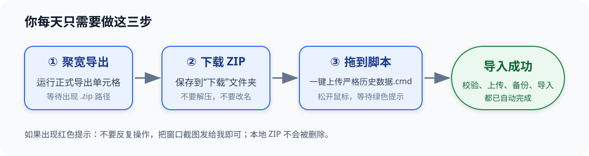
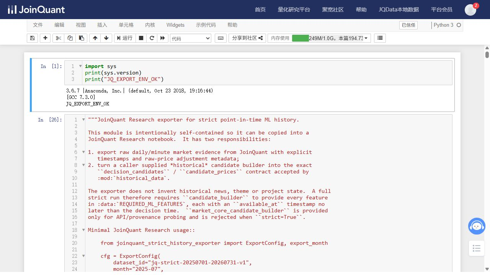

# 严格历史数据三步操作说明（小白版）

日常只做三件事：在聚宽运行导出脚本、下载 ZIP、把 ZIP 拖到桌面上传图标。服务器校验、备份和导入都由脚本完成。



## 第一次使用前：生成两份最终脚本

双击桌面的“**一键生成聚宽策略快照**”。成功后在项目 `output` 文件夹看到：

- `聚宽原生回测策略.py`
- `聚宽严格历史导出.py`

服务器策略没有更新时，不需要每月重新生成。

## 第一步：在聚宽导出

1. 登录聚宽，进入“量化研究平台”→“研究环境”。
2. 为避免 1 GB 内存被旧任务占用，先保存其他 Notebook；内存很高时点击“重启研究环境”。
3. 选择“新建”→“Python 3”。
4. 用记事本打开 `output/聚宽严格历史导出.py`，按 `Ctrl+A`、`Ctrl+C` 复制全部内容。
5. 回到聚宽，只在一个空代码单元格中粘贴一次。不要粘在旧代码后面。
6. 搜索这一行并改月份，例如：

   ```python
   STRICT_EXPORT_MONTH = "2025-07"
   ```

7. 点击上方“运行”，等待出现：

   ```text
   STRICT_EXPORT_OK
   月份: 2025-07
   候选行: ...
   价格路径行: ...
   导出包: jq_strict_exports/...-2025-07.zip
   ```

真实页面中“运行”按钮的位置如下：



一个月只运行一个任务，不要并发。运行期间不要关闭页面或重复点“运行”。出现红色错误时不要改成宽松模式。

### 可选：先看聚宽自己的回测结果

如果想先用聚宽撮合验证同一策略：进入“我的策略”→“新建策略”→“空白模板”，用 `聚宽原生回测策略.py` 完整替换编辑器代码，设置开始/结束日期、资金和“分钟”，保存后运行回测。它和导出器使用同一快照，但回测结果不是训练 ZIP。

## 第二步：下载 ZIP

1. 回到聚宽研究文件列表。
2. 打开 `jq_strict_exports`。
3. 打开本次数据集文件夹。
4. 下载输出中显示的 `.zip` 文件到电脑“下载”文件夹。

不要解压、改名、用 Excel 保存内部 CSV，或重新压缩。ZIP、manifest 和 metadata 必须保持原样。

## 第三步：拖到上传图标

1. 打开电脑“下载”文件夹。
2. 按住 ZIP，拖到桌面“**一键上传严格历史数据**”图标上并松开。
3. 等待窗口完成：本地校验、连接服务器、上传、服务器备份与原子导入、结果核对。
4. 看到绿色“**导入成功！**”才算完成。

不方便拖拽时，双击上传图标，在文件选择窗口选中 ZIP 也可以。重复上传完全相同的 ZIP 是幂等操作，不会重复写入。

## 出错时怎么做

保留 ZIP，把黑色窗口或聚宽红色错误从上到下完整截图发给我。不要自行关闭哈希校验、修改 manifest、覆盖同月份冲突包或登录服务器手工替换数据库。

| 提示 | 含义 |
| --- | --- |
| `FEATURE_FROM_FUTURE` | 某特征晚于决策时点，必须修代码，不能忽略。 |
| `D10_PRICE_HORIZON_NOT_MATURE` | 月末还没有后续 10 个交易日，等数据成熟。 |
| `STRICT_DAILY_HISTORY_INSUFFICIENT` | 单只股票日线不足；最终脚本会跳过补位，若整批失败再排查。 |
| `INVALID_NUMBER: prev_close` | 旧导出器遇到了停牌或缺失前收盘价。重新一键生成脚本，确认版本至少为 `2026-08-10.27`，完整替换旧单元格后重跑。 |
| `history database and WAL reserve exceed...` | 服务器仍在使用旧的容量估算代码。不要调高 3 GB 上限；同步当前版本后重试。 |
| ZIP/表哈希失败 | 下载不完整或内容被改动，重新从聚宽下载。 |
| 同月份内容不同 | 版本身份不一致，停止覆盖并核对快照。 |
| 服务器连接失败 | 稍后重试一次，仍失败就截图。 |

上传脚本不会重置密钥、Token 或 Webhook，也不会在导入失败时用临时库替换正式历史库。

正式整月包的本地复核、上传、服务器二次复核和建库可能持续十几分钟。窗口仍在运行、CPU 仍有变化时不要重复启动；只有看到绿色“导入成功！”才能关闭。
