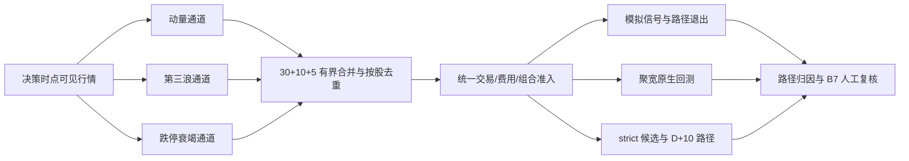

# 多路径因子模拟策略设计

> 状态：本地实现。本文定义 B0–B7 的唯一业务口径；在提交、服务器部署、重新生成聚宽快照和代表性交易日观察完成前，不得写成已部署或已验证，更不得用于真实资金。

## 目标与边界

现有 `momentum_v1` 路径保持原有选股与执行语义，同时增加两条仅用于模拟验证的路径：

- `wave3_v1`：两段上涨和两次回撤完成后，以抬高的高低点、相近的上涨时长/幅度和缩量回撤识别第三浪候选。
- `limitdown_exhaustion_v1`：连续 2–4 个跌停后的首次开板出现放量承接，再等待下一交易日 09:50 后确认卖压衰竭。

三条路径共享同一个时点数据契约、组合风控、A 股 100 股手数、真实费用估算和审计链。新路径始终标记 `simulation_only=true`，不会自动改变模型、批准参数或真实资金权限。

## B0–B7 完整口径

| 批次 | 能力 | 完成条件 |
| --- | --- | --- |
| B0 | 反前视与模拟隔离 | 所有日线早于决策日、分钟 K 线不晚于决策时点；未来 bar 立即失败；新路径只能模拟 |
| B1 | 共享因子契约 | 稳定路径名、setup ID、分数、价格计划、风险预算、容量和拒绝代码可在服务器与聚宽 Python 3.6 共用 |
| B2 | 多通道候选池 | 动量 30、第三浪 10、跌停衰竭 5、总计最多 45；按股票去重但保留多路径归因 |
| B3 | 第三浪因子 | 只使用已确认局部枢轴；两段上涨 3–12 日、总结构 8–35 日、第二高低点抬高、两次回撤 15%–50% 且缩量；4 根闭合 5 分钟 K 线突破确认 |
| B4 | 跌停衰竭因子 | 非 ST/退市风险的沪深主板；连续 2–4 跌停、首次开板换手/收盘位置/低点反弹达标；仅下一交易日 09:50 后在 VWAP 上方且不破开板低点时确认 |
| B5 | 精确经济性与组合容量 | 费用、滑点、印花税和最低佣金进入 100 股取整；预计往返成本率不高于 0.4%，目标毛利大于成本 3 倍；第三浪最多 2 个持仓/每日 1 个，跌停衰竭最多 1 个持仓/每日 1 个 |
| B6 | 路径退出、回放和归因 | 第三浪 2R、5 日未达 0.5R、10 日上限；跌停衰竭 1R 盈利保护、1.5R、3 日上限；实时、聚宽原生回测和 strict 重放一致记录路径、setup、拒绝与费用 |
| B7 | 研究准入 | 第三浪至少 50 个完成周期、跌停衰竭至少 30 个；净期望为正、利润因子至少 1.2、剔除前三笔后仍稳定、3 段 walk-forward 至少 2 段同向、最大回撤不越过基线边界；只输出建议，不自动放权 |

## 数据与决策流

## 第三浪定义

日线先做前复权一致化，再从 90 个已完成交易日寻找已经被左右各 2 根日线确认的 `L-H-L-H-L` 枢轴。结构必须同时满足：

- 两段上涨各 3–12 个交易日，总结构 8–35 个交易日。
- 两段上涨时长相似度至少 0.60，涨幅相似度至少 0.50。
- 第二高点高于第一高点，第二回撤低点高于第一回撤低点。
- 两次回撤深度各为对应上涨段的 15%–50%。
- 两次回撤平均成交量均不高于对应上涨段的 85%。
- 最后低点确认后最多等待 3 个交易日。

盘中必须已有至少 4 根闭合 5 分钟 K 线。最新价同时高于当日 VWAP 和前三根最高价，行业相对强度为正，且突破追价幅度不超过 `min(2%, 0.5×ATR/突破价)` 才触发。

## 跌停衰竭定义

该路径只覆盖代码前缀 `000/001/002/003/600/601/603/605`，上市至少 250 个交易日，近 20 日平均成交额至少 1 亿元。连续跌停后的首次开板日必须满足：

- 前面连续锁定跌停 2–4 日。
- 首次开板成交额至少为此前 20 日均值的 1.5 倍。
- 收盘位于当日振幅的 65% 以上。
- 从当日低点反弹至少 3%。
- 没有严重公告风险，所属板块跌停家数没有继续加速，市场不是 `RISK_OFF`。

确认窗口只在首次开板后的下一交易日有效。09:50 前、少于 4 根闭合 5 分钟 K、跳空低于 -3% 或高于 5%、跌回 VWAP 下、跌破开板日低点或最近 60 分钟再次封死跌停，均不允许买入。

## 费用、仓位和退出

下单数量按以下顺序只向下取整：风险预算 → 单路径仓位上限 → 组合剩余仓位 → 可用现金 → 100 股手数 → 含费用现金复核。止损处的净亏损不得超过风险预算。

第三浪单笔风险预算 0.50%，仓位上限 12%；跌停衰竭单笔风险预算 0.35%，仓位上限 8%。这两个上限仍受全局最大持仓数、总仓位、行业、题材、每日换手、当日亏损、账户回撤和连续亏损限制，不能覆盖原有风控。

新路径退出覆盖原通用分层退出，但任何已有更高优先级的未完成退出意图仍继续执行：

| 路径 | 止损 | 盈利/时间退出 |
| --- | --- | --- |
| `wave3_v1` | 冻结初始止损或市场 `RISK_OFF` 全退 | 达到 2R 全退；持有 5 日仍低于 0.5R 全退；10 日全退 |
| `limitdown_exhaustion_v1` | 冻结初始止损或市场 `RISK_OFF` 全退 | 达到 1R 后把保护位上调到成本线与 `最高价-1ATR` 较高者；1.5R 或 3 日全退 |

## 归因与研究准入

每个候选保存主路径、全部候选通道、setup ID、路径状态、分数、稳定拒绝代码、经济性估算和 `simulation_only`。同一股票同时进入多通道时只产生一个交易候选，但 `factor_attributions` 保留各通道证据，防止去重后无法研究重叠贡献。

实时运行只在有界 `signals.json` 诊断中保存当批路径汇总；strict 数据把归因作为带 `available_at` 的候选特征保存，并继续使用现有月包容量、哈希、原子导入和数据库备份机制。没有新增无界 JSONL 或永久逐轮报告。

B7 只生成 `passed/reasons/metrics`。参数变化必须经过独立 walk-forward、人工审批、版本登记和另行发布授权；代码不得根据研究结果自动改配置、重启服务或提升到真实资金。

## 失败关闭规则

- 未来日线或分钟 bar：`FACTOR_BAR_FROM_FUTURE`，整条 strict 构建失败。
- 因子组合容量无法从持仓周期和未完成买单恢复：`factor_portfolio_state_unavailable`。
- 价格计划、费用计划或可用现金不完整：拒绝新路径买入，不影响已有持仓卖出。
- 因子异常只允许有界审计；反前视、身份哈希和包完整性异常不得降级绕过。
- 未知因子路径持仓使用失败关闭的全退建议，不猜测退出规则。

## 安全和发布

快照不包含服务器地址、SSH 私钥、Token、Webhook、账户或数据库。服务重启不是代码实现的一部分；如后续获得明确授权，部署前必须备份数据库并记录 `stock-analysis.env` 哈希，重启后只比较哈希是否一致，绝不打印或修改内容。任何哈希变化都立即停止。
